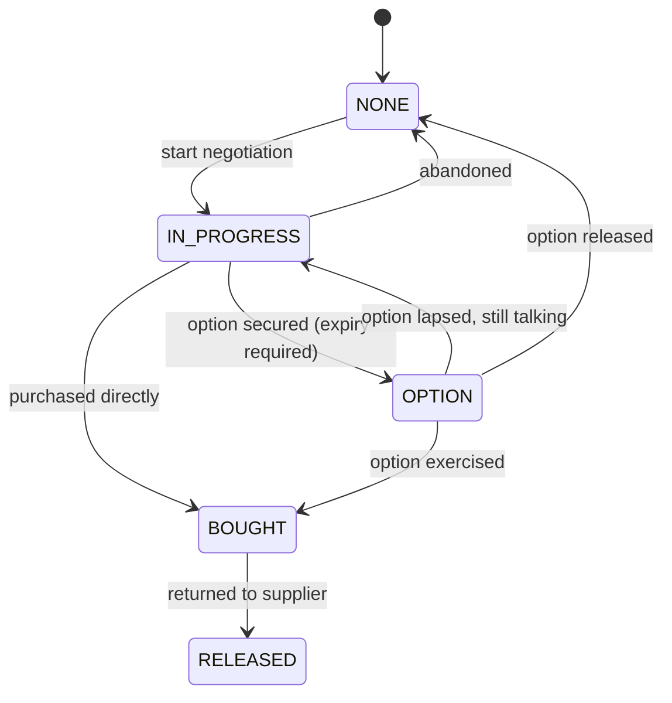
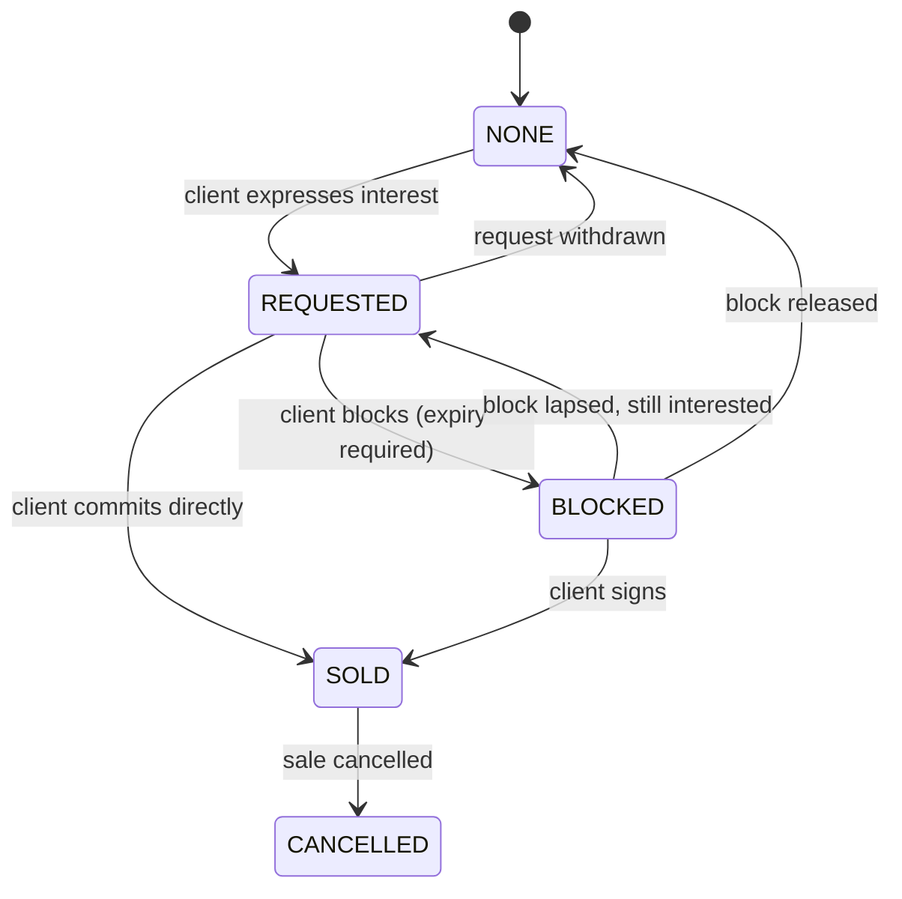

# We Lodge OS — Product Scope: Inventory Management

**Status:** Phases 1–2 built, Phase 3 specified · **Date:** 2026-09-04 ·
**Audience:** product + engineering

See §12 for exactly what is implemented today. This document and the code move
together — if they disagree, that is a defect in one of them.

This document defines the **core business logic** of the We Lodge inventory tool. It is
deliberately implementation-free: no API shapes, no screens, no framework decisions. It
describes the entities, the states, the rules that must always hold, and the questions the
system has to be able to answer.

---

## 1. The business in one paragraph

We Lodge buys accommodation from suppliers (hotels, apartment operators) and sells it to
B2B clients (federations, broadcasters, sponsors, event teams). We are a **market maker in
room-nights**. The commercial risk is positional: we can be *short* (sold to a client
before securing it from a supplier) or *long* (bought stock nobody has taken). Ideally we
sit on stock for as little time as possible. Everything in this tool exists to make the
current position visible, per room, per night.

Three delivery phases:

| Phase | Question it answers |
| --- | --- |
| **1. Scouting** | What could we contract? |
| **2. Acquisition & Sales** | What do we hold, what have we promised, and where are we exposed? |
| **3. Operations** | Will the rooming lists we received actually work against what we hold? |

---

## 2. Foundational decisions

These were settled up front because everything else follows from them.

### 2.1 The atomic unit is a **room-night on a room slot**

The system's unit of record is a single **room-night**: one *room slot* on one *calendar
date*. A **room slot** is an internal, stable identity — `property + room category + slot
number` (`Hotel Carmel / King Room / #5`). It is *not* the hotel's real room number; it is
our own numbering, allocated 1..N within a category, so that supply and demand can be
matched to the same countable thing.

The legacy add-on already reached this conclusion: it keys everything on
`roomId = supplier::category::roomNumber`, and its internal model is literally a
`RoomNight { roomId, night, buy?, sale? }`. The hotel's real room number lives separately —
it appears as *Actual unit number* on the operations sheet, and only matters at
rooming-list time.

Everything the user sees as a "row" — `Hotel Carmel, King Room, #5, 11-Jul → 05-Aug,
blocked` — is a **derived stay row**: a run of contiguous nights on one slot sharing the
same state tuple. See §5.4.

**Why:** partial changes are the norm, not the exception. A client drops three nights, a
supplier confirms half the range, a team arrives a week late. On a night grain these are
edits; on a range grain they are row splits, which is exactly the operation that makes the
current spreadsheet fragile.

**Night convention (invariant):** a stay from check-in `10-Jul` to check-out `31-Jul`
occupies the nights `10-Jul … 30-Jul` — **21 nights**. A night is identified by the date it
*begins*. Check-out day is never a night. All dates are local calendar dates at the
property; no timestamps, no time zones.

### 2.2 Supply and demand are **two independent axes**

Every room-night carries two states at once:

- an **acquisition state** — our relationship with the supplier;
- a **sales state** — our relationship with the client.

They move independently. The "ideal flow" (`Requested → In Progress → Option → Blocked →
Sold → Bought`) is a **diagonal walk across a 2-D grid**, not a single status field.

**Why:** the single most commercially important situation — *sold to the client while still
only an option (or worse, still in negotiation) with the supplier* — is unrepresentable in
a one-field model. The existing icon legend already encodes the grid; this makes it
first-class and alertable.

### 2.3 Inventory hangs off an **Event**

`Event → Property → Category → Slot → Room-night`. A property is scouted once and can be
reused across events; its *inventory* always belongs to exactly one event.

### 2.4 Deadlines alert, they never auto-change state

An expired option or block is **flagged**, never silently downgraded or released. The
system does not know what the supplier believes; a human decides to extend, convert or
release. Expiry drives urgency and dashboards, not mutations.

---

## 3. Phase 1 — Scouting

A scouting list is the long list of properties that *could* be contracted for an event.
It is research, not inventory: nothing here implies a commercial position.

### 3.1 Property

Common to every type:

| Field | Notes |
| --- | --- |
| `name` | |
| `type` | `HOTEL` \| `APARTMENT` \| `APARTHOTEL` |
| `address`, `city`, `country` | |
| `latitude`, `longitude` | Optional. Present ⇒ pin on the map view. |
| `distanceToVenue` | Derived from coordinates + the event's venue, when both exist. |
| `stars` | Hotels and aparthotels; optional. Not asked of a plain apartment. |
| `amenities` | Many-to-many against a controlled vocabulary (§3.4). |
| `contacts` | Name, role, email, phone. Zero or more. |
| `notes` | Free text. |
| `scoutedBy`, `scoutedAt` | |

Note what is *not* here: **scouting status is not a property attribute**. The same hotel can
be shortlisted for one event and rejected for another, so status lives on the scouting entry
(§3.5), not on the property.

**A property's name is unique, globally** — not just within one event's scouting list.
Properties are shared across events (§3.5), so the same hotel scouted for two Games must be
the *same* record, added to both scouting lists, rather than two records that split its
contacts, amenities and history. `name` is compared case-insensitively with surrounding
whitespace trimmed — "Hotel Carmel", "hotel carmel" and " Hotel Carmel " all name one place —
so a rep cannot accidentally re-create a property that already exists under slightly
different capitalisation. The scouting form checks this as the name is typed and blocks
saving on a match; the same check runs again on the server, since the form's check alone
cannot be trusted.

**Deleting a property** is separate from removing a scouting entry (§3.5): it takes the
property out of the shared library for good, so it is refused while the property is still on
any event's scouting list, or carries booked inventory. Take it off every list first — the
property page states this rather than silently doing nothing.

**Map:** the list is the source of truth; the map is a *view* over whatever has
coordinates. Import from Google My Maps (KML/CSV) is the expected ingestion path for the
first load. A property with no coordinates is valid and simply absent from the map.

**Finding coordinates:** the scouting form can look an address up on OpenStreetMap rather
than making a rep hunt down latitude/longitude by hand. It is a convenience, not a source of
truth — a rep can always override what comes back, and a miss just means entering the
numbers manually, the same as today.

### 3.2 Hotel specifics

A hotel has one or more **room categories**:

| Field | Notes |
| --- | --- |
| `name` | "King Room", "Twin", "1 Bedroom" |
| `roomCount` | Total rooms in that category at the property |
| `capacity` | Standard occupancy (pax) |
| `bedConfiguration` | e.g. 1×King, 2×Twin — drives Operations checks (§6.4) |
| `indicativePriceCents` + `currency` | Price per night at scouting time — indicative only, not a contracted rate |

`Property.totalRooms` = Σ `roomCount` across categories, and must be recorded even where
categories are not yet broken out.

### 3.3 Apartment specifics

An apartment is modelled as a category whose units are whole flats:

| Field | Notes |
| --- | --- |
| `bedrooms` | Required |
| `bathrooms` | Required; allow halves (`1.5`) |
| `unitCount` | How many identical units |
| `capacity` | Sleeps N |
| `indicativePriceCents` + `currency` | |

**Simplification:** an apartment unit behaves exactly like a hotel room slot — an
indivisible, sellable, occupiable thing. Bedrooms/bathrooms are attributes of the unit, not
sub-inventory. We never sell a bedroom inside an apartment separately. *(If we ever do,
this decision has to be revisited; it is the one place where the model would need a level.)*

**Aparthotel** is a third type for self-contained, apartment-style units that are still
star-rated and run like a hotel — the common real-world case of a serviced apartment
building with reception and housekeeping. Its categories use these same
bedrooms/bathrooms fields, not a hotel's `bedConfiguration`; the only thing it takes from
the hotel side is `stars` (§3.1).

### 3.4 Amenities

A single controlled list shared by every property type (`WiFi`, `Breakfast included`,
`Parking`, `Air conditioning`, `Gym`, `Pool`, `Kitchen`, `Washing machine`, `Lift`,
`Accessible`, `Pets allowed`, `24h reception`, `Airport shuttle`, …). Free-text amenities
are rejected; the list is admin-editable so it stays a filter rather than a tag soup.

### 3.5 The scouting list

A **scouting entry** puts one property on one event's list. It is the event-specific view of
a property that otherwise exists once, globally:

| Field | Notes |
| --- | --- |
| `event`, `property` | Unique together — a property appears at most once per event |
| `status` | `PROSPECT` → `CONTACTED` → `SHORTLISTED` → `REJECTED` \| `CONTRACTED` |
| `notes` | Event-specific: what this hotel said about *this* event |
| `addedBy`, `createdAt` | |

Status meanings, which the interface states rather than assumes:

| Status | Meaning |
| --- | --- |
| `PROSPECT` | On the long list. Nobody has spoken to them yet. |
| `CONTACTED` | We have reached out and are waiting to hear back. |
| `SHORTLISTED` | A serious candidate — worth taking to a client. |
| `REJECTED` | Ruled out for this event. Kept so we do not re-scout it. |
| `CONTRACTED` | Moved through to acquisition; Phase 2 owns it from here. |

Removing an entry takes the property off that event's list only. The property stays in the
library for other events — which is the point of scouting once.

### 3.6 Scouting → inventory

Converting a `CONTRACTED` property into inventory is an explicit act: pick the event, the
category, a slot range (`#1..#30`) and a date range, and the system materialises those
room-nights at acquisition state `NONE`. Nothing is contracted by this act. This is the
only bridge between Phase 1 and Phase 2.

The `CONTRACTED` status is enforced, not advisory: materialising a property that is only
shortlisted or contacted is refused, and says so. Re-running the same conversion over an
overlapping range is safe — it adds the missing nights and leaves the existing ones, and
their commercial position, untouched.

---

## 4. Phase 2 — Acquisition & Sales

### 4.1 The acquisition axis (supply)



| State | Meaning |
| --- | --- |
| `NONE` | Known inventory, no supplier relationship on this night |
| `IN_PROGRESS` | Actively negotiating — yet to be acquired |
| `OPTION` | We hold the right to purchase until `optionExpiry` |
| `BOUGHT` | Acquired under an agreement — this is We Lodge stock |
| `RELEASED` | Previously bought, handed back (kept for audit, counts as not held) |

Required attributes: `supplierRef`, `optionExpiry` (mandatory in `OPTION`),
`buyPriceCents`, `currency`, `owner` (the We Lodge rep), `notes`.

### 4.2 The sales axis (demand)



| State | Meaning |
| --- | --- |
| `NONE` | No client interest on this night |
| `REQUESTED` | A client would like these room-nights — **soft, non-exclusive** |
| `BLOCKED` | The client holds the right to purchase until `blockExpiry` — **exclusive** |
| `SOLD` | The client has bought these room-nights — **exclusive** |
| `CANCELLED` | Previously sold, cancelled (kept for audit, counts as not sold) |

Required attributes: `client`, `clientRef`, `blockExpiry` (mandatory in `BLOCKED`),
`sellPriceCents`, `currency`, `owner`, `notes`, `dueDate`.

**`dueDate` is the client's decision deadline while the hold is still open** — asked for
only when blocking, never when selling. `SOLD` means the client has already signed; there is
no further decision to chase, so the sale form does not ask for one. (Resolves the open
question this used to be — §9.)

Only `NONE`, `BLOCKED`, `SOLD` and `CANCELLED` are ever *stored* on a room-night: those are
the hard hold, and a night has at most one. `REQUESTED` is never stored there — a request
is a soft claim and lives in its own record, of which a night may have many (§4.3). It
appears in the list above because it is a value the *displayed* state can take.

A client is a global record, not a per-event one: the same federation comes back for the
next Games, and "what have we sold this buyer, ever" is worth being able to answer.

> **Change from the sheet.** Today a block may carry no expiry — the stock sheet renders it
> as *"blocked indefinitely"*. An indefinite block is inventory frozen for free and, worse,
> invisible to every deadline report. `blockExpiry` becomes mandatory; a genuinely
> open-ended block must be recorded as an explicit and reportable exception.

### 4.3 Exclusivity and contention — an important rule

- A room-night has **at most one hard hold**: exactly one client may be `BLOCKED` or
  `SOLD` on it. Attempting a second is a hard error.
- A room-night may carry **many soft requests**: `REQUESTED` is a *set* of client claims,
  not a state that locks the slot.

**Why:** two clients routinely want the same hotel before either commits. A single-valued
sales field forces us to either lose that information or fake a hold we do not have.
Modelling requests as a set makes **contention** — "three clients want 40 King Rooms at
Hotel Carmel on 12-Jul and we hold 30" — a directly measurable number, which is what
drives the acquisition push.

The *displayed* sales state of a room-night is the hard hold if one exists, otherwise
`REQUESTED` if any request touches it, otherwise `NONE`.

### 4.4 The position grid

The pair `(acquisition, sales)` yields the position — this is the stock sheet's icon
legend, made computable:

| acq ↓ / sale → | NONE | REQUESTED | BLOCKED | SOLD |
| --- | --- | --- | --- | --- |
| **IN_PROGRESS** | ⚙️ in progress | ⚙️ in progress | ⚠️ blocked by client, in progress with supplier | 🚀 **red** — sold, urgent supplier action |
| **OPTION** | 🕐 option held | 🕐 option held | 🚀 amber — client holds, we only hold an option | 🚀 amber — sold, option not yet exercised |
| **BOUGHT** | 🏠 We Lodge stock | 🏠 We Lodge stock | 🏠 stock, client blocking | ✅ bought and sold — all good |
| **NONE** | — free | ❗ demand with no supply line | ⚠️ hard hold, no supply | 🚨 **critical** — sold, nothing started |

**Severity** is a derived integer, used for sorting, colour and alerting:

| Severity | Condition |
| --- | --- |
| 4 · critical | `SOLD` and acquisition is `NONE`; or `SOLD` + `OPTION` where the option expires within the urgency window (§4.6) |
| 3 · urgent | `SOLD` + `IN_PROGRESS` |
| 2 · warning | `BLOCKED` + (`IN_PROGRESS` \| `NONE`); or `SOLD` + `OPTION` outside the urgency window |
| 1 · watch | `BOUGHT` with no hard hold (idle stock); any expiry inside the reminder window |
| 0 · clear | `BOUGHT` + `SOLD`; or `NONE`/`NONE` |

**Cells the severity table does not name.** The grid has sixteen cells; the table above
covers nine conditions. The rest were settled while building, reading the grid's own colours
as the intent:

| Position | Severity | Why |
| --- | --- | --- |
| `BOUGHT` + `BLOCKED` | 0 · clear | A block *is* a hard hold, so this is not idle stock |
| `BOUGHT` + `REQUESTED` | 1 · watch | A request holds nothing, so this is still idle stock — but somebody is asking, which is the cue to convert it |
| `OPTION` + `BLOCKED` | 2 · warning | The grid renders it amber, the same as `SOLD` + `OPTION` outside the urgency window |
| `OPTION`/`IN_PROGRESS`/`NONE` + `REQUESTED` | 1 · watch | Demand with no hold on either side. Worth seeing, not yet a problem |
| `OPTION` + `NONE`, `IN_PROGRESS` + `NONE` | 0 · clear | Normal progress with nobody waiting |

**How a deadline escalates.** §4.6 says the urgency window escalates severity without saying
to what. Concretely, and applied on top of the grid — a deadline can only make a position
worse, never better:

- inside the reminder window ⇒ at least **1**;
- inside the urgency window, **or already expired** ⇒ at least **2**;
- the grid's own rule still applies over that, so `SOLD` + `OPTION` inside the urgency
  window is **4** rather than 2.

**Only binding deadlines are read.** An option expiry stops mattering the moment the night
is bought, and a block expiry the moment the block is lifted. A stale date on a state that
has moved on never colours a row or reaches the deadline dashboard.

This grid is the legacy `getStockTextFromRoomNight` / `getStockColorFromRoomNight` pair
turned into data instead of two parallel `if` ladders. Two behaviours worth keeping from the
old renderer: every cell names the **client** and the **binding deadline** ("Blocked by
CNOSF until 12-Jul; we hold an option until 09-Jul"), because that is what a rep needs in
order to act; and `REQUESTED` renders distinctly (🙋) rather than being folded into "nothing
is happening here".

### 4.5 Invariants

These must hold at all times; violating one is a blocked operation or a flagged record,
never a silent write.

1. **Single hard hold.** At most one `BLOCKED`-or-`SOLD` client per room-night.
2. **Slot uniqueness.** `(property, category, slotNumber, date)` is unique. One room-night
   record, one truth.
3. **Slot bound.** Slot numbers within a category may not exceed the category's
   `roomCount` unless the category's count is explicitly raised.
4. **Expiry required.** `OPTION` without `optionExpiry`, or `BLOCKED` without
   `blockExpiry`, is invalid.
5. **Deadline coherence.** `optionExpiry ≥ blockExpiry` on the same night. If a client's
   block outlives our option to supply it, we are promising something we may not be able
   to deliver — flag at severity ≥ 2.
6. **Exposure is legal but never invisible.** Selling before buying is allowed — it is the
   business — but every such night appears on the exposure report with a value attached.
7. **Dates are closed-open.** `checkIn < checkOut`; nights are `[checkIn, checkOut)`.
8. **State changes are append-only.** Every transition writes a ledger entry (§4.7).
9. **Currency consistency.** Buy and sell on the same night may differ in currency, but
   aggregation always states its currency; no implicit conversion.

### 4.6 Deadlines

Two clocks per night: `optionExpiry` (supplier side) and `blockExpiry` (client side), plus
`dueDate` — the client's decision deadline while `BLOCKED` (§4.2). It has nothing to chase
once `SOLD`, so it is not asked for there.

- **Reminder window** — configurable, default 7 days out: severity ≥ 1, appears on the
  deadline dashboard.
- **Urgency window** — configurable, default 48 hours: severity escalates (amber → red).
- **Expired** — the state is unchanged and the record is flagged `expired`. It stays in the
  user's face until someone extends, converts or releases it.

The **deadline dashboard** is a first-class screen: everything expiring, soonest first,
grouped by property and client, with the value at stake.

**Calendar reminders (carried over).** The add-on's most-used feature is a scheduled job
that writes option expiries into a shared Google Calendar. Keep it, with its aggregation
rule intact: **one all-day event per supplier per expiry date**, whose body carries the
number of rooms, the number of room-nights and the responsible rep — not one event per row.
Events are keyed `supplier::date` and reconciled on each run, so re-running never
duplicates them, and expiries already in the past are skipped.

Sales-side (block) reminders exist in the legacy code but are commented out — a direct
consequence of blocks being allowed to have no expiry. With `blockExpiry` now mandatory
(§4.2), block reminders ship on the same mechanism, keyed `supplier::date::client`.

**Not built.** The calendar sync itself needs Google credentials and a scheduled job, and
neither exists in this system yet. The deadline dashboard is built and carries the same
aggregation — one row per property per client per expiry date, with rooms, room-nights and
the value at stake — so nothing is invisible in the meantime; it just does not reach anyone's
calendar. The windows are 7 days and 48 hours as specified, but as constants in the code:
there is no screen for changing them yet.

### 4.7 Ledger and ownership

Every room-night change appends an immutable entry: `timestamp`, `actor` (the We Lodge
rep), `axis`, `from`, `to`, `affected nights`, `reason/note`. This gives the "We Lodge Rep"
and "Inserted Date" columns of the spreadsheet a real home, and makes "who promised this
and when" answerable.

Every room-night also has an `owner` per axis — the rep accountable for chasing the
supplier and the rep accountable for the client.

### 4.8 Bulk operations are the primary interaction

Because the grain is a night, **no meaningful action is single-record**. The core mutation
is: *apply a state transition to a rectangle* — a set of slots × a date range — with the
state's required attributes, atomically. It either applies wholly or fails wholly, with a
per-night explanation of any invariant that blocked it.

Required bulk actions: acquire/option/buy, request/block/sell, extend a deadline, release,
re-price, reassign owner, shift dates (§6.5), and split/merge a hold across slots.

All of these are built except **shift dates**, which belongs with the Phase 3 simulation it
references, and **split/merge a hold**, which waits on open question 3 — whether a hold is
an object in its own right. Splitting a hold is nonetheless already possible through the
same primitive: release the client's hold on some rooms and sell on others, in two
operations. What is missing is doing it as one act with one ledger entry.

A refusal names the rooms, not each night separately: twenty-one identical lines for one
room is a wall rather than an explanation, so consecutive nights failing for the same reason
collapse into one line naming the range.

---

## 5. Reporting and derived views

### 5.1 Position per property/category/night

For any `(property, category, date)`: counts by acquisition state, counts by hard-hold
sales state, request pressure (distinct clients requesting, total rooms requested), and
net position:

```
held      = count(BOUGHT)
committed = count(SOLD)
short     = count(SOLD)   - count(SOLD AND BOUGHT)      // sold but not owned
long      = count(BOUGHT) - count(BOUGHT AND hard hold) // owned but unsold
```

### 5.2 Exposure report

Every night where the sales position is stronger than the acquisition position, valued:

- **Short exposure** — `SOLD` (or `BLOCKED`) without `BOUGHT`. Value = expected buy cost we
  have not secured, plus the sale price we would fail to deliver.
- **Long exposure** — `BOUGHT` with no hard hold. Value = committed cost sitting on the
  book. *(Not selected as a blocking Operations validation, but it is the direct
  financial consequence of sitting on stock, so it belongs in this report.)*
- **Deadline exposure** — value of everything whose option or block expires inside the
  reminder window.

### 5.3 Availability — what we can still offer

Distinct from *position*, and the thing a rep needs when a client asks "what have you got?".
The legacy definition — computed by the supplier summary and written back into the Supplier
sheet — is deliberately strict and worth keeping as the default:

> Availability for a `(property, category)` over an **event period** is the number of
> **whole slots** free on **every night** of that period. A slot is free on a night if the
> night falls outside the period, or if we hold it (`BOUGHT` or `OPTION`) and it is not
> `SOLD`.

Three consequences, all intentional, two worth confirming (§9):

- **All-or-nothing per slot.** A slot free for 19 of 21 nights contributes zero. We sell
  whole stays, not fragments, so a partially free room is not offerable as-is.
- **Only `SOLD` consumes availability.** Blocks and requests do not reduce it — an
  optimistic reading that assumes blocks lapse. This should be reported alongside a second,
  conservative figure — *availability net of hard holds* — so a rep sees both what is
  theoretically free and what is genuinely free.
- **Only held stock counts.** `IN_PROGRESS` and unacquired nights are *not* available,
  which is correct: we cannot offer what we have not secured.

The event period is per `(property, category)`, not global — a hotel may be relevant for
only part of an event. Until open question 10 is settled, the period is **derived from the
inventory that exists** for that `(property, category)` — its first night to its last — and
can be overridden per report. That is a reporting choice, not a commercial fact: if the
window a hotel will contract for is a real term of the deal, it belongs on the contract.

### 5.4 The stock sheet (derived stay rows)

The familiar spreadsheet view is generated, never stored. Collapse adjacent nights on the
same slot into a row while this tuple is unchanged:

```
(slot, acquisitionState, salesState, client, supplierRef,
 optionExpiry, blockExpiry, owner, buyPrice, sellPrice)
```

A row's `checkIn` is the first night's date; `checkOut` is the last night's date **+ 1
day**. Rows are grouped by property → category → slot number, matching today's layout, and
each row carries the icon/severity from §4.4. Editing a row edits the nights beneath it.

---

## 6. Phase 3 — Operations

Operations begins when a client sends a rooming list. The job is to prove that what we
hold can actually accommodate what they are sending, and to keep proving it as the plan
moves.

### 6.1 Entities

**Party** — a travelling group inside a client (a team, a delegation, a crew). Fields:
`client`, `name`, `nominalArrival`, `nominalDeparture`, `pax`, `earliestArrival`,
`latestDeparture`, `categoryPreference`, `propertyPreference`, `notes`.

`earliestArrival` / `latestDeparture` are the **flexibility window**: the pre-authorised
range within which this party may move without renegotiation. "Team 1 might arrive 3
nights earlier, Team 2 arrives 7 days later" is exactly this field. A shift inside the
window is an operational change; a shift outside it is a commercial change and must go back
through Sales.

**Guest** — a named person: `firstName`, `lastName`, `party`, `arrival`, `departure`,
`sharingWith`, `accessibilityNeeds`, `notes`. A guest's dates default to the party's and
may be individually overridden.

**Assignment** — the link between guests and inventory: `slot` + date range + the guests
occupying it. An assignment consumes room-nights we hold. An assignment also carries the
**actual unit number** — the hotel's own room number, which we only learn at allocation
time and which is what the guest and the front desk actually use. Our slot number and the
hotel's room number are different things and both must be visible on operational exports.

**Planned vs actual dates.** The legacy Overview sheet carries two check-in columns: the
contracted date and the operationally confirmed one. Keep both. `plannedArrival` is what was
sold; `confirmedArrival` is what operations expects to happen. Divergence between them is
precisely the flexibility this phase exists to absorb, and it is what drives the arrival
reminders below.

### 6.2 Rooming list intake

A rooming list arrives as a spreadsheet per client per party. Intake must: accept an
upload, map columns, validate rows, and produce a diff against the previously loaded
version (added guests, removed guests, changed dates, changed sharing) rather than
overwriting. Versions are retained — "which rooming list were we working from" is an
operational question that gets asked after the fact.

### 6.3 Validation — coverage

For every guest-night implied by the rooming list, there must be a corresponding room-night
that is **`BOUGHT` and `SOLD` to that client**.

Failure modes, each reported per night with counts:

- **Uncovered night** — no assignment exists for a guest on that night.
- **Not owned** — assigned to a night whose acquisition state is not `BOUGHT` (this is
  short exposure landing in operations; severity inherits from §4.4).
- **Wrong client** — assigned to a night sold to a different client.
- **Over-assignment** — more guests assigned to a slot-night than its capacity.
- **Category mismatch** — assigned to a category the party did not buy.

### 6.4 Validation — capacity and occupancy

- `pax` on a slot-night ≤ category `capacity`.
- Bed configuration vs sharing: two unrelated guests sharing a King is a flag, not an
  error; three guests in a twin is an error.
- Apartment units: total guests ≤ unit `capacity`; report `bedrooms` vs party size so the
  operator can judge.
- Accessibility needs must land in a property carrying the `Accessible` amenity.
- Unassigned guests and unoccupied sold nights are both reported.

### 6.5 Date-shift what-ifs

A **simulation**, never a commit. Input: one or more proposed shifts (`Party X: −3
nights`, `Party Y: +7 days`). Output, without touching stored state:

- the new coverage picture, with every check from §6.3 and §6.4 re-run;
- **what breaks** — the specific nights that become uncovered or not-owned;
- **what frees up** — nights that become idle and could be resold;
- whether each shift sits inside or outside the party's flexibility window;
- the financial delta (nights to buy, nights now unsold).

A simulation can be **applied**, which turns it into a bulk operation (§4.8) with a single
ledger entry describing the shift. Simulations are saved so two options can be compared.

### 6.6 Arrival reminders

Carried over from the add-on and worth keeping as-is in behaviour: an all-day calendar
event per **client per property per check-in date**, titled with the head count
(`CNOSF (24 PAX) check-in @ Hotel Carmel`). The reconciliation rule matters more than the
format — on each run the job diffs desired reminders against existing ones and **updates
the head count when it changes**, deletes reminders whose check-in has disappeared, and
removes duplicates. Rooming lists change constantly; a reminder showing a stale PAX count is
worse than none.

### 6.7 Re-validation

Validation is continuous, not a one-off gate. Any change to a rooming list, an assignment,
or the underlying inventory re-runs the checks for the affected event and updates the
issue list. The operational dashboard is "open issues, by severity, by party".

---

## 7. Financials

Money is carried on the room-night, on both axes, in **minor units** (integer cents) with
an explicit currency. This is the finest grain at which a rate can genuinely differ, and
every aggregate is a sum over nights.

| Field | Axis | Meaning |
| --- | --- | --- |
| `buyPriceCents`, `buyCurrency` | acquisition | What we pay the supplier for that night |
| `sellPriceCents`, `sellCurrency` | sales | What the client pays us for that night |

Derived:

- **Margin per night** = `sellPrice − buyPrice` (only meaningful where both are set).
- **Committed cost** = Σ `buyPrice` over `BOUGHT` nights.
- **Contracted revenue** = Σ `sellPrice` over `SOLD` nights.
- **Realised margin** = over nights that are both `BOUGHT` and `SOLD`.
- **Pipeline margin** = over nights not yet in both states, reported *separately* and
  never added to realised margin.
- **Cost at risk** = Σ estimated `buyPrice` over `SOLD`-not-`BOUGHT` nights, using the
  category's indicative price where no negotiated price exists. This is the number that
  makes short exposure concrete.
- **Idle cost** = Σ `buyPrice` over `BOUGHT` nights with no hard hold.

Aggregations must be available by event, property, category, client, party and date range.

**Out of scope for v1:** invoicing, payment tracking, FX conversion (aggregates are
reported per currency), taxes and tourist levies, commission splits, deposit schedules.
`dueDate` is captured as a deadline only, with no payment state behind it.

---

## 8. Non-goals for v1

- Channel-manager or GDS integration; all supplier communication stays human.
- Guest-facing anything — no booking engine, no confirmations to guests.
- Automatic release of stock on expiry (§2.4).
- Selling sub-units of an apartment (§3.3).
- Yield management, dynamic pricing or demand forecasting.
- Multi-currency consolidation.

---

## 9. Open questions

1. **Release deadlines on bought stock.** Do supplier agreements carry a cancellation
   window where bought nights can still be handed back? If so `RELEASED` needs its own
   deadline clock alongside options and blocks.
2. **Slot stability across suppliers.** If a client's rooms move from Aloft to Courtyard,
   does the sale follow the client (re-point the hold to new slots) or is it cancelled and
   re-sold? This determines whether a hold is an object in its own right or purely a
   property of nights.
   *Still open, and now blocking: a hold is currently a property of nights, which is why
   split/merge is not a single operation (§4.8).*
3. **Contracted vs indicative price.** Should a negotiated rate live on the category
   (a rate card per event) with the night-level price as an override, rather than being
   entered per night?
4. **Roles and permissions.** Is the "We Lodge Rep" an accountability label only, or does
   it gate who may sell/buy/release?
5. **Overbooking policy.** Do we ever deliberately sell more than we hold at a category
   level, and if so should the system allow a configured tolerance rather than flagging
   every night?
6. **Apartment slot numbering.** Do apartment units carry a real unit identifier from the
   operator, or is our internal slot number sufficient?
7. **Availability semantics (§5.3).** Should blocks reduce availability by default? And is
   whole-period, all-or-nothing availability still right, or should partial availability be
   offerable when a client's own stay is shorter than the event window?
   *Still open. Both figures are reported side by side in the meantime, so the answer can be
   read off real data rather than guessed at.*
8. **Indefinite blocks (§4.2).** Are there clients whose blocks genuinely have no deadline,
   and if so what is the review cadence that replaces an expiry date?
9. **Event period per property.** The legacy Supplier sheet sets a start/end per
    `(property, category)`. Is that a commercial fact (the window the hotel will contract
    for) or just a reporting filter? If the former it belongs on the contract, not the view.
    *Still open. Availability currently derives the window from the inventory on record,
    which is the reporting reading (§5.3).*

---

## 10. Glossary

| Term | Meaning |
| --- | --- |
| **Room-night** | One room slot on one calendar date. The atomic record. |
| **Room slot** | `property + category + slot number`. Our internal identity for a countable room. |
| **Stay row** | A derived run of contiguous nights on one slot sharing a state tuple. |
| **Hard hold** | `BLOCKED` or `SOLD` — exclusive; at most one per room-night. |
| **Soft request** | `REQUESTED` — non-exclusive; many clients may request the same night. |
| **Short** | Sold (or blocked) without being bought. |
| **Long / idle stock** | Bought with no hard hold against it. |
| **Exposure** | Any night where the sales position is stronger than the acquisition position. |
| **Flexibility window** | A party's pre-authorised `earliestArrival` → `latestDeparture` range. |
| **Position grid** | The `(acquisition, sales)` matrix that yields icon and severity. |

---

## 11. Appendix — inherited business logic (`duvet` Apps Script)

Rules that exist only in the legacy add-on's code, recorded so they are inherited
deliberately rather than lost or re-discovered. Source: `~/duvet` (`src/inventory/*`,
`src/reminders/*`, `src/tests/*`).

### 11.1 What the add-on actually does

Three sheets in, two sheets out. `Inventory` (`Supplier, Room Category, Room Number,
Check-in, Check-out, Status, Option expires, We Lodge Rep`) and `Sales` (same plus
`Reservation expires, Client`) are read as stay rows and **exploded into a room-night
matrix**; that matrix is written back as the `Stock` sheet — one row per slot, one column
per night, coloured and captioned — and an availability figure is written back into the
`Supplier` sheet. A master spreadsheet holds a `URLs` tab listing one workbook per event,
which the scheduled reminder job iterates.

**This confirms both foundational decisions (§2).** The night grain and the two-axis model
are not new: they are what the add-on computes internally at every run. What it lacks is
the ability to *store* them — the sheets remain range-shaped, so the explosion is redone
from scratch each time and cannot be edited at the grain the business actually operates at.

### 11.2 Validation rules to carry over

Enforced today on stay rows, per `roomId`, per axis:

| Rule | Legacy behaviour |
| --- | --- |
| At least one night | `checkIn >= checkOut` is invalid — a zero-night row is rejected |
| Option needs a deadline | Status `option` without `Option expires` is invalid |
| No overlaps | Two non-cancelled rows on the same slot and axis may not overlap |
| Fail loud | Any invalid row aborts the entire run; offending rows are highlighted red |
| Header contract | Column headers are checked by name and position before anything is read |

Two notes. First, the overlap check has a **known gap**: it detects an overlapping row that
starts or ends inside another, but not one that fully *contains* another, so a wholly
enclosing duplicate slips through. Second, and more importantly, **storing room-nights
makes overlap structurally impossible** — uniqueness on `(slot, date)` replaces the check
entirely, along with its bug. Zero-night and missing-deadline validation still apply, at
input time.

The "fail the whole run" behaviour should *not* be carried over verbatim. Refuse the
invalid operation, not the entire dataset; the equivalent of red-highlighting is a per-night
explanation attached to the rejected bulk operation (§4.8).

### 11.3 Cancellation is an overlay, not a state

The single least obvious rule in the codebase. A row with status `cancelled` **subtracts**
from any overlapping non-cancelled row for exactly the nights it covers:

```
bought      31-Dec → 05-Jan
cancelled   31-Dec → 01-Jan
cancelled   04-Jan → 05-Jan
⇒ held on 01, 02, 03 Jan only
```

It is a workaround for range-shaped storage: it punches holes in a stay without splitting
the row, and preserves the fact that something *was* held. On a night grain the subtraction
disappears — you simply set those nights — but the intent must survive: **releasing or
cancelling must never erase history.** That is what `RELEASED` / `CANCELLED` plus the ledger
(§4.7) are for. Cancelled rows are also exempt from validation today, and the ledger makes
that exemption unnecessary.

### 11.4 Rendering rules embedded in the stock sheet

The cell text is richer than the printed legend and encodes real judgement:

| Position | Legacy cell |
| --- | --- |
| bought + sold | `✅ {client}` |
| bought + blocked | `⚠️ Blocked by {client} until {date}. We have it on stock` |
| bought + requested | `🙋 Requested by {client}. We have it on stock` |
| bought only | `🏠 Stock` (green) |
| option + sold | `🚀 Acquire for {client}. We have option until {date}` (yellow) |
| option + blocked/requested | `⚠️`/`🙋` + `We have option until {date}` |
| option only | `🕙 Option until {date}` |
| in progress + sold | `🚀 Acquire for {client}. We are in progress` (yellow) |
| in progress only | `⚙️ In progress` |
| nothing + sold | `🚀 Acquire for {client} urgently.` (red) |
| nothing + blocked | `⚠️ Blocked by {client} until {date}.` (yellow) |

The pattern: **the cell states the action and the deadline, not just the state.** Red is
reserved for sold-with-nothing-secured; yellow for sold-against-an-option or
blocked-against-nothing. That is the severity scale of §4.4, and it should be computed from
one table rather than re-derived per surface.

### 11.5 Odds and ends

- **Dates** are parsed and stored as UTC midnight from a `1-Jan-24` string. Calendar dates
  with no time component is the right model (§2.1); the string format is a spreadsheet
  artefact and should not survive.
- **Room-nights per row** = `checkOut − checkIn` in whole days, confirming the closed-open
  night convention.
- **The matrix spans** the earliest check-in to the latest check-out across *all* rows —
  the stock view has no fixed calendar of its own.
- **Naming drift.** Reminder bodies still say "Khaya rep"; test fixtures use
  `till@khaya.global` and a two-part `roomId`. Cosmetic, but a reminder that a
  string-keyed identity drifts. The new system should use real foreign keys, not
  `supplier::category::number` strings.
- **Operations sheet columns** worth mining when Phase 3 is specified: `Status`, `#`,
  `# per property`, `Property`, `Client`, `Unit Type`, `Actual unit number`, `Check In`,
  `Check out`, `Total RN`, `Check In` (confirmed).

---

## 12. Implementation status

What is actually built, as of the last commit that touched this file. **This table is part
of the contract**: anything marked *Built* can be relied on; anything else is a description
of intent, not of software. Keep it accurate in the same commit as the code.

| Section | Status | Notes |
| --- | --- | --- |
| §3.1 Property | **Built** | Name, type, address, city, country, coordinates, stars, website, phone, notes, stated total |
| §3.2 Hotel categories | **Built** | Name, room count, capacity, bed configuration, indicative price |
| §3.3 Apartment units | **Built** | Bedrooms and bathrooms, halves allowed |
| §3.4 Amenities | **Built** | Controlled list, seeded; edited in `prisma/seed.ts`, not in the app |
| §3.5 Scouting list | **Built** | Per-event entries, status, filters by status, type and amenity |
| Map view | **Built** | Leaflet over OpenStreetMap, list-first as specified; venue pin and derived distance-to-venue |
| Google My Maps import | **Not built** | Coordinates are typed in by hand for now |
| §3.6 Scouting → inventory | **Built** | Contracted property → category → room range → date range. `CONTRACTED` is enforced; re-running is safe |
| §4.1 Acquisition axis | **Built** | All five states, the transitions the diagram allows, and no others |
| §4.2 Sales axis | **Built** | Hard hold as stored state; `blockExpiry` mandatory, with no way to record an indefinite block |
| §4.3 Exclusivity and contention | **Built** | One hard hold per night, enforced; requests are a set, and contention is counted on the stock sheet and per night |
| §4.4 Position grid and severity | **Built** | One table, used by every screen. Cells the spec left unscored are recorded in §4.4 |
| §4.5 Invariants | **Built** | 1–4 and 7–9 are enforced on write; 5 is a flag, as specified; 6 is the exposure report |
| §4.6 Deadline dashboard | **Built** | Everything expiring, soonest first, grouped by property and client, with value at stake |
| §4.6 Calendar reminders | **Not built** | Needs Google credentials and a scheduled job. The dashboard carries the same aggregation |
| §4.7 Ledger and ownership | **Built** | One entry per bulk operation, linked to every night it touched; an owner per axis |
| §4.8 Bulk operations | **Built** | Every required action except shift-dates (Phase 3) and split/merge as one act (open question 3) |
| §5.1 Position per night | **Built** | Counts by state, request pressure, and net short/long |
| §5.2 Exposure report | **Built** | Short, long and deadline exposure, valued per currency |
| §5.3 Availability | **Built** | Both the optimistic and the conservative figure, side by side |
| §5.4 Stock sheet | **Built** | Derived stay rows, grouped property → category → room |
| §6 Operations | **Not built** | Phase 3 |
| §7 Financials | **Built** | Buy and sell price per night; committed cost, contracted revenue, realised and pipeline margin, cost at risk, idle cost — per currency, never converted |
| Deadline windows configurable | **Not built** | 7 days and 48 hours are constants in the code, with no screen to change them |

### Deliberate departures from the specification above

Recorded here rather than silently: each is a place where building it changed our mind.

1. **Scouting status moved from the property to the scouting entry** (§3.1, §3.5). A hotel
   can be shortlisted for one event and rejected for another; a single status per property
   cannot express that. The specification was updated to match.
2. **Amenities are seeded, not managed in the app.** §3.4 calls the list admin-editable.
   Until there is an admin screen, it is edited in `prisma/seed.ts` — which is honest for
   Phase 1 but is a gap, not a decision.
3. ~~**Categories are replaced wholesale on save**, rather than diffed.~~ **Resolved in
   Phase 2.** Room slots now hang off a category, so categories are edited in place. A
   category that already carries inventory cannot be removed, and its room count cannot be
   reduced below the highest room number in use — both are refused with an explanation
   rather than quietly taking the inventory with them.
4. **A soft request is never stored as a night's state** (§4.2, §4.3). The night stores the
   hard hold; requests are separate records. This is what makes "one hard hold per night" a
   fact of the database rather than a rule somebody has to remember to check.
5. **A room slot is a stable identity across events; the room-night carries the event**
   (§2.1, §2.3). `(slot, date)` is unique, which is what makes the legacy overlap check —
   and its known bug — unnecessary rather than reimplemented.
6. **`RELEASED` and `CANCELLED` collapse to "nothing" for every count and every position**,
   because that is what §4.1 and §4.2 say they mean. They keep their own wording on screen,
   because "we handed this back" and "nothing ever happened here" are different facts and a
   rep needs to tell them apart.
7. **Calendar dates are formatted in UTC.** They are stored as calendar days at the property
   (§2.1); rendering them in the reader's own time zone showed 09-Jul to a reader in Los
   Angeles for a night that begins on the 10th. This was a latent Phase 1 defect that Phase 2
   made unmissable.
8. **Margin is left out where buy and sell are in different currencies**, and the count of
   such nights is reported. Inventing a rate would be the one thing invariant 9 forbids.
