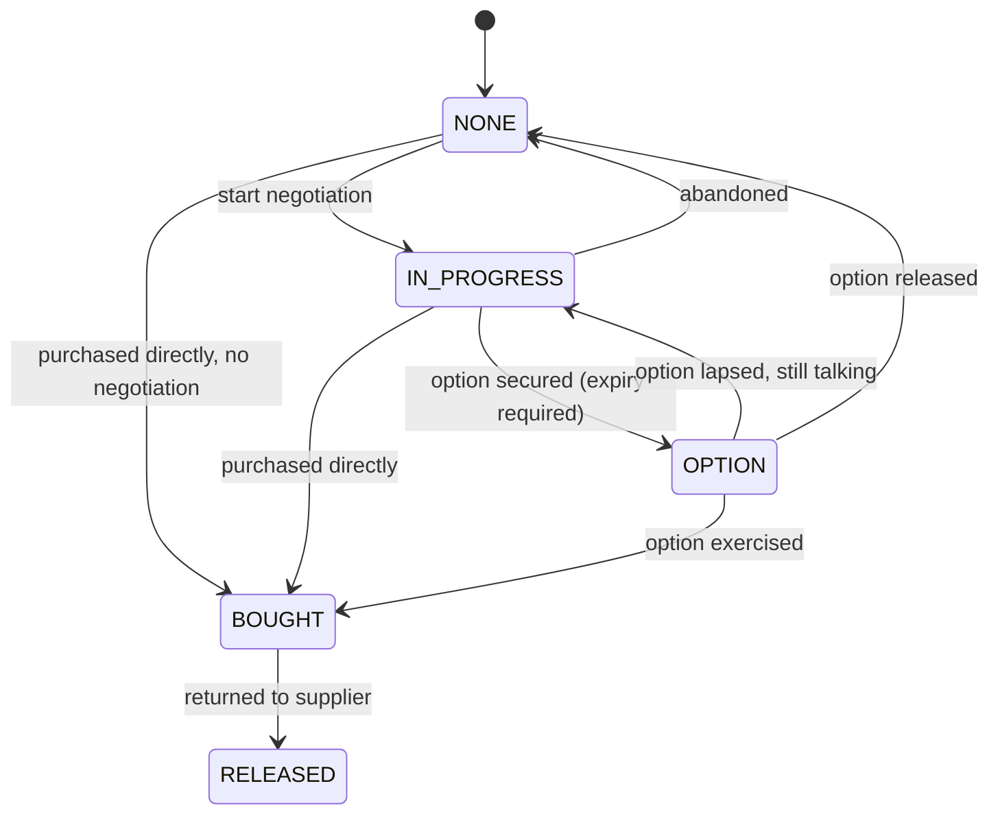
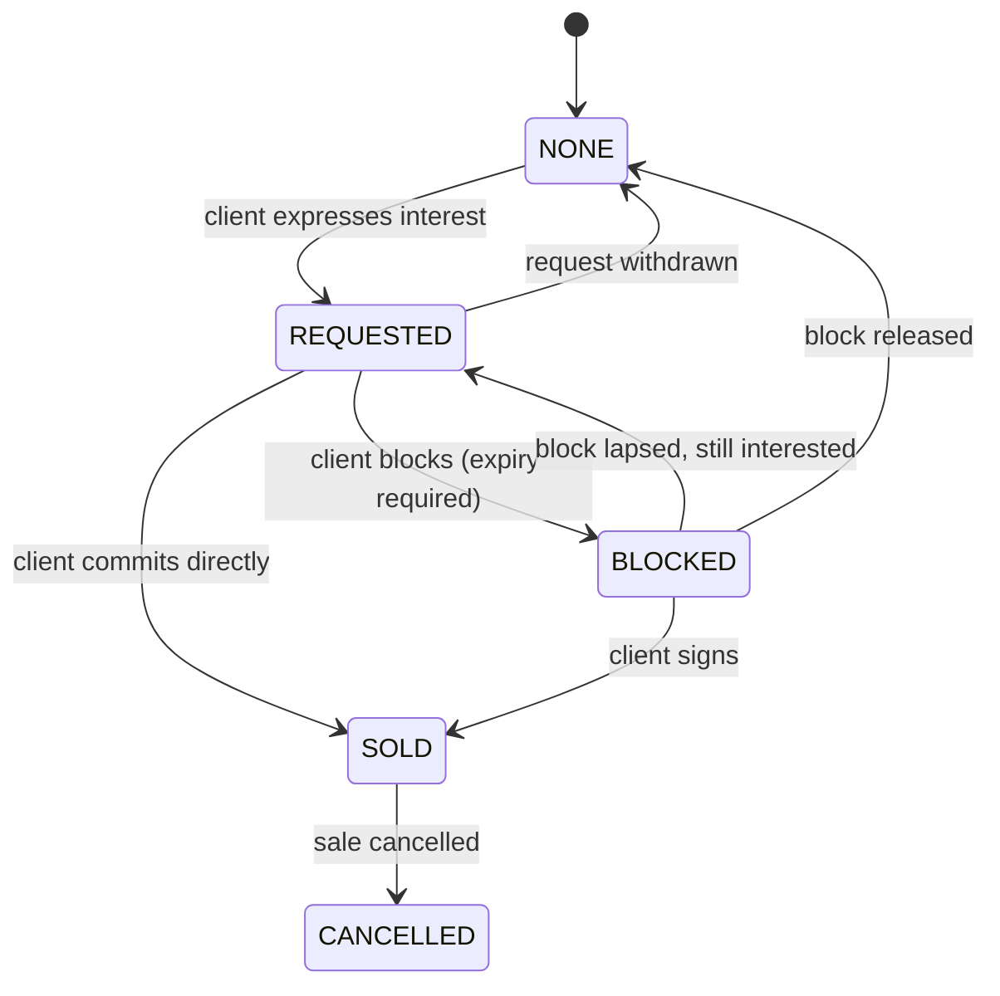

# We Lodge OS — Product Scope: Inventory Management

**Status:** Phases 1–2 built and deployed; places of interest (§3.7) and the Google map built
but not yet live; travel times (§3.8) and client map links (§5.5) specified · **Date:**
2026-09-24 ·
**Audience:** product + engineering

See §12 for exactly what is implemented today. This document and the code move
together — if they disagree, that is a defect in one of them.

This document defines the **core business logic** of the We Lodge inventory tool. It is
deliberately implementation-free: no API shapes, no screens, no framework decisions. It
describes the entities, the states, the rules that must always hold, and the questions the
system has to be able to answer.

---

## 1. The business in one paragraph

We Lodge buys accommodation from suppliers (hotels, apartment operators) and sells it to
B2B clients (federations, broadcasters, sponsors, event teams). We are a **market maker in
room-nights**. The commercial risk is positional: we can be *short* (sold to a client
before securing it from a supplier) or *long* (bought stock nobody has taken). Ideally we
sit on stock for as little time as possible. Everything in this tool exists to make the
current position visible, per room, per night.

Three delivery phases:

| Phase | Question it answers |
| --- | --- |
| **1. Scouting** | What could we contract? |
| **2. Acquisition & Sales** | What do we hold, what have we promised, and where are we exposed? |
| **3. Operations** | Will the rooming lists we received actually work against what we hold? |

---

## 2. Foundational decisions

These were settled up front because everything else follows from them.

### 2.1 The atomic unit is a **room-night on a room slot**

The system's unit of record is a single **room-night**: one *room slot* on one *calendar
date*. A **room slot** is an internal, stable identity — `property + room category + slot
number` (`Hotel Carmel / King Room / #5`). It is *not* the hotel's real room number; it is
our own numbering, allocated 1..N within a category, so that supply and demand can be
matched to the same countable thing.

The legacy add-on already reached this conclusion: it keys everything on
`roomId = supplier::category::roomNumber`, and its internal model is literally a
`RoomNight { roomId, night, buy?, sale? }`. The hotel's real room number lives separately —
it appears as *Actual unit number* on the operations sheet, and only matters at
rooming-list time.

Everything the user sees — `Hotel Carmel, King Room, #5, 11-Jul → 05-Aug, blocked` — is
**derived at read time**, never stored as a range: a run of contiguous nights on one slot
sharing the same state simply looks identical, cell after cell. See §5.4.

**Why:** partial changes are the norm, not the exception. A client drops three nights, a
supplier confirms half the range, a team arrives a week late. On a night grain these are
edits; on a range grain they are row splits, which is exactly the operation that makes the
current spreadsheet fragile.

**Night convention (invariant):** a stay from check-in `10-Jul` to check-out `31-Jul`
occupies the nights `10-Jul … 30-Jul` — **21 nights**. A night is identified by the date it
*begins*. Check-out day is never a night. All dates are local calendar dates at the
property; no timestamps, no time zones.

### 2.2 Supply and demand are **two independent axes**

Every room-night carries two states at once:

- an **acquisition state** — our relationship with the supplier;
- a **sales state** — our relationship with the client.

They move independently. The "ideal flow" (`Requested → In Progress → Option → Blocked →
Sold → Bought`) is a **diagonal walk across a 2-D grid**, not a single status field.

**Why:** the single most commercially important situation — *sold to the client while still
only an option (or worse, still in negotiation) with the supplier* — is unrepresentable in
a one-field model. The existing icon legend already encodes the grid; this makes it
first-class and alertable.

### 2.3 Inventory hangs off an **Event**

`Event → Property → Category → Slot → Room-night`. A property is scouted once and can be
reused across events; its *inventory* always belongs to exactly one event.

### 2.4 Deadlines alert, they never auto-change state

An expired option or block is **flagged**, never silently downgraded or released. The
system does not know what the supplier believes; a human decides to extend, convert or
release. Expiry drives urgency and dashboards, not mutations.

### 2.5 Who can get in, and where the system runs

**Sign-in is Google Workspace, and only Google Workspace.** A person reaches We Lodge OS
by signing in with their `@welodge.net` Google account; there is no password to set, no
account to create and no invitation to send. Adding somebody to the Workspace is what
grants access, and removing them is what withdraws it — the system holds no separate list
of who is allowed in. Anyone without a Workspace account cannot get in at all, which today
means every supplier and every client.

**Someone who is not signed in sees only the sign-in screen.** Any address on the site —
the front page included — sends them there, and it shows the We Lodge logo, a *Continue
with Google* button and nothing else: no menu, no description of what the system does or
holds. A stranger who finds the address learns only that something here needs a We Lodge
account.

Two consequences worth stating plainly, because neither is obvious from a screen:

- **Everyone who signs in sees everything.** There are no roles yet. A rep can read and
  change any event, any property and any client, not only their own. This is a known gap,
  not a decision (§9, open question 5). The one exception is chat (§2.7): a conversation
  is visible only to the colleagues in it.
- **A first sign-in creates the account silently.** Anyone in the Workspace who visits the
  site becomes a user of it, with full access, the moment they sign in.

**One exception: client map links (§5.5).** A client who has been sent a link can open that
one page without signing in. It shows a chosen shortlist and nothing else; it cannot be
used to reach any other part of the system, and a rep can switch it off at any time.

The system is a website, not something anyone installs. It runs at
**https://os.welodge.net**, hosted on Vercel, with its database (PostgreSQL, hosted by
Neon in Frankfurt) owned by the We Lodge Vercel team. It answered at `welodge-os.vercel.app` until
2026-09-24; that address now redirects to this one, so older links and bookmarks still
arrive.

**Every change passes through staging first.** A second copy of the system runs at
**https://staging.welodge.net**, built from the `staging` branch, with its own database.
A change is pushed to `staging`, checked there, and only then merged into `master`, which
is what reaches the live site. Staging exists so that a change — and above all a change
to the database's structure — is tried on real data before the team depends on it.

- **Staging's database is a copy of the live one**, taken with Neon's branching. That is
  deliberate: a database change rehearsed on invented demo data proves little. It follows
  that staging holds real client and supplier data, and is treated with the same care —
  the demo reset (`pnpm run db:seed`) is never run against it.
- **Staging is reset to the live data every night at midnight UTC** (01:00 in London
  and 02:00 in Berlin during summer time; 00:00 and 01:00 in winter). Whatever was entered
  on staging that day is gone the next morning, and nothing on staging ever flows back to
  the live system: staging is for trying things, not for keeping them. Straight after the
  reset, the database changes that are on staging but not yet live are applied again — so
  every night also rehearses the next release's database change on that day's real data.
  The same reset can be run by hand at any time (`docs/todos.md` §1 says how).
- **Signing in works the same way on both**: the same Google Workspace accounts, but a
  separate session — being signed in to one does not sign you in to the other.
- **Every change is built automatically before it deploys** (GitHub Actions): the code is
  type-checked and built against an empty database, which also proves every migration
  applies from scratch. A change that fails this cannot be merged into `master`.

Magic-link sign-in by email is built and deliberately switched off: at launch nobody
outside the Workspace needs an account. It becomes available again by configuring an email
sender, without any code change. See `docs/todos.md` §2.

### 2.6 Updates — a running history per property and client

A property or a client keeps a running, append-only feed of free-text posts — a meeting
note, a call summary, feedback from the field — the same way `LedgerEntry` keeps a
permanent record of every inventory change (§4.7). Unlike a room-night, an update is never
about a commercial position, so it sits outside all three phases and applies to a property
or a client regardless of what phase work is happening on it.

A post can mention a colleague with `@Name`, which highlights their name inline. This is a
visual tag only: nothing is sent to them, and nothing is stored beyond the post's own text
— there is no notification, and no record of who was mentioned separate from the words
themselves. That is a deliberate, minimal first version; if the team wants a mentioned
colleague to actually be notified, that is a distinct piece of work (an email or in-app
notification path does not exist yet, per §2.5).

**Its author can edit an update; nobody can delete one.** An *Edit* link sits beside each of
your own posts, and only your own — a colleague's cannot be changed by anyone else. An
edited post says so underneath, with when: "Edited today at 14:05", or "Edited 25 Sept at
09:12". It keeps its original date in the feed and its place in the order; editing does not
bump it to the top.

This relaxes what was originally a rule that a post could never change, the same as the
ledger. What that rule protected is kept: every earlier wording of a post is stored when it
is replaced, so nothing that was said is lost, and the "Edited" note means a reader always
knows the text is not what was first posted. The earlier wordings are not shown anywhere yet
— there is no "see previous versions" — but they are there if they are ever needed.

### 2.7 The team — profiles and internal chat

Like Updates, this sits outside the three phases: it is about the people at We Lodge, not
about room-nights. It is reached by hovering over (or clicking) **We Lodge AG** at the foot
of the sidebar, which opens a small menu — *My profile*, *Team* and *Messages*. On a phone,
where there is no sidebar, a *Team* link in the header leads to the same place. A count of
unread messages shows beside the company name, so it is visible without opening the menu.

**The profile.** Each person completes their own, and only their own: their name, a job
title, and any number of phone numbers. Every number is marked **Mobile**, **WhatsApp** or
**Mobile & WhatsApp** — the third exists because one number is usually both, and making
someone enter it twice would be busywork. The numbers keep the order the person gave, so
the first is the one to try first. The email shown is the Google account the person signs
in with (§2.5). It cannot be changed from the profile, because it is not a contact detail
the person chose but the identity that lets them in; changing it would lock them out.

**The team directory** lists everyone who has ever signed in, with their title, email and
numbers, and a *Message* button that opens a private conversation with that person.

**Finding a colleague from Messages.** The list of conversations has a search box above it.
Typing narrows the conversations to those whose name, or whose members' names, match, and
lists underneath — under *Start a conversation* — any colleague who matches by name, email
or job title and whom you have not messaged privately yet. Choosing one opens a private
conversation with them. Enter opens the first result. Before you have any conversations at
all, the list shows every colleague, so there is always somewhere to start.

**Who is around.** Everyone's picture carries a coloured dot, in the directory, in the list
of conversations and at the top of an open conversation, with the words beside it where
there is room:

| Dot | Means |
| --- | --- |
| Green | **Active** — using the system in the last couple of minutes |
| Empty circle | **Away** — has not clicked, typed or moved the mouse in the system for about five minutes, does not have it open, or has set themselves as away |
| Red with a bar | **Do not disturb** — set by hand |

Active and Away are **automatic**, judged from activity rather than from whether a tab is
merely open: a tab left in the background all afternoon does not keep someone green.
Nothing about this is stored as a status — the system records when a person last used it,
and works out Active or Away whenever someone looks.

The status button at the top of every page shows your own, and offers three choices, as
Google Chat does:

- **Automatic** — Active or Away, from your activity, as above.
- **Do not disturb** — the message chime is silent for you; messages still arrive and
  still count as unread.
- **Set as away** — you show as Away even while you are using the system.

Each lasts until you choose another. Nobody else is told anything when a status changes; it
is only visible on the dot. *At lunch* and *Done for the day* are not on this menu: they
are ready-made statuses in your own words (below), which is where a time limit belongs.
They were briefly dot statuses of their own; anyone who had one set when that changed kept
it, carried across as the matching own-words status with the same end time.

**A status in your own words.** Separately from the dot, a person can say what they are
doing — *Add a status* in the same menu. It has an emoji, chosen from a short list, and up
to 64 characters of text, and it shows beside their name in the directory, in the list of
conversations and at the top of a conversation with them. A few common ones can be picked
in one click, each with the time it usually lasts: *At lunch* (an hour), *Be right back*
(30 minutes), *In a meeting* (an hour), *Commuting* (an hour), *On a site visit* (today),
*Out sick* (today), *On holiday* (this week) and *Done for the day* (today). Whichever it is, the person chooses when it stops showing: after
30 minutes, an hour or four hours, at the end of today, at the end of this week (Sunday),
at a date and time of their choosing, or never. "Today" and "this week" end at midnight
where the person is. It can be cleared by hand at any time. The two are independent: you
can be *Do not disturb* with no status, or *Active* while *At lunch*.

**Chat.** There are two kinds of conversation:

- **Private** — between exactly two colleagues. A pair only ever has one: pressing
  *Message* on someone you have already talked to reopens that conversation rather than
  starting another. It cannot be left, and nobody can be added to it — for a third person,
  start a group.
- **Group** — named, with any number of members. Anyone in a group can add colleagues to
  it; a newcomer sees the whole history, including what was said before they joined. Anyone
  can leave a group, and then no longer sees it.

A message is text, a GIF, or both. Like an update (§2.6), **its sender can edit the text,
and nobody can delete a message.** On your own messages an *Edit* link appears when you point at the message — and
always on a touch screen, which cannot point. The message is changed where it stands, in
its place in the conversation, and shows *Edited* beside its time; pointing at that says
when. Every earlier wording is kept, but not shown anywhere yet. An edit is not a new
message: nobody is told, it plays no chime and makes nothing unread. You can only edit a
message in a conversation you are still in. A
message counts as unread for a member until they have had the conversation open on screen;
your own messages are never unread to you.

**Reacting, replying, emoji and GIFs.** Pointing at a message — or always, on a touch
screen — shows a small bar beside it, as Google Chat does:

- **Three quick reactions**: the three you react with most, or 👍 ❤️ 😂 until you have
  favourites of your own. One click reacts; the reaction shows under the message with how
  many gave it, and pointing at it says who. Clicking a reaction you gave takes it back;
  clicking one somebody else gave adds yours. Anyone in the conversation can react to any
  message in it, their own included. A reaction is not a message: it plays no chime and
  makes nothing unread.
- **More reactions** opens the full emoji picker: a search, the ones you use most, every
  emoji by category, skin tones, and **We Lodge emoji** — the team's own.
- **Reply** quotes the message: the box says *Replying to …* until the reply is sent (or ✕
  is clicked), and the reply shows the quoted message above it — whose, and its first
  lines. Clicking the quote scrolls to the original and marks it for a moment. A reply can
  only answer a message in the same conversation.

**The team's own emoji.** *+ Add a We Lodge emoji*, at the foot of the picker, takes a
picture and a short name — two to 32 letters, numbers, dashes or underscores, like
*welodge* or *la28*. The picture is shrunk to a small square in the browser before it is
saved, so it is a few kilobytes and is kept in the database itself; no file storage is
needed. Names are unique. Everyone can then react with it. They are for reactions only:
a message is words, so the emoji button beside the box puts ordinary emoji into the text
but not the team's own. They cannot be removed yet.

**Emoji in a message.** The ☺︎ button beside the box opens the same picker, and puts the
chosen emoji where the cursor is.

**GIFs.** The *GIF* button beside the box opens GIFs from GIPHY: trending ones, a few quick
searches (*thank you*, *wow*, *oops*…) and a search box. Clicking one sends it at once — as
a reply, if one is being written. Only the link is stored; the picture is shown from
GIPHY, and only GIPHY's own addresses are accepted, never one typed in. GIFs are limited
to GIPHY's *PG-13* rating. The search runs on our server, so the GIPHY key is never sent to
anyone's browser; without a key the GIF button says so (`docs/todos.md`). The conversation
list shows a GIF as *GIF*.

**What chat is deliberately not, yet** — each of these is a separate piece of work, not an
oversight:

- **It is not instant.** There is no live connection to the server: an open conversation
  checks for new messages every few seconds, and the unread count every ten. A message
  can therefore take a few seconds to appear on the other side.
- **No notification leaves the system.** Nobody is emailed or pushed anything. Inside it,
  there are two signals: the unread count, and a short chime whenever that count goes up
  while the system is open in a browser tab. The chime does not play for a message in the
  conversation you are looking at, nor when the system is closed. Browsers only allow a
  page to make sound after you have clicked or typed on it, so a tab that has just been
  opened stays silent until then. It is also silent while you are on Do not disturb.
  The sound can be switched off from the Team menu; that
  choice is remembered per browser, not per person. With the system open in two tabs, the
  chime plays in both.
- **No files.** Sharing a file needs somewhere to store it (for example Vercel Blob, which
  has to be switched on in the Vercel account). It was held back until that is set up.
- **No calling.** Neither calling from inside the system nor tap-to-call buttons on the
  numbers. Agreed to come later.

**Chat is the one exception to "everyone sees everything"** (§2.5). A conversation is
visible only to its members; nobody else can open it from the system, whatever they know
about it. It is not private from whoever runs the database, which is where the messages are
stored.

---

## 3. Phase 1 — Scouting

A scouting list is the long list of properties that *could* be contracted for an event.
It is research, not inventory: nothing here implies a commercial position.

### 3.1 Property

Common to every type:

| Field | Notes |
| --- | --- |
| `name` | |
| `type` | `HOTEL` \| `APARTMENT` \| `APARTHOTEL` |
| `address`, `city`, `country` | |
| `latitude`, `longitude` | Optional. Present ⇒ pin on the map view. |
| `distanceToVenue` | Derived: straight-line distance to the event's **nearest venue** (§3.7), when both have coordinates. |
| `stars` | Hotels and aparthotels; optional. Not asked of a plain apartment. |
| `amenities` | Many-to-many against a controlled vocabulary (§3.4). |
| `contacts` | Name, role, email, phone. Zero or more. |
| `notes` | Free text. |
| `scoutedBy`, `scoutedAt` | |

Note what is *not* here: **scouting status is not a property attribute**. The same hotel can
be shortlisted for one event and rejected for another, so status lives on the scouting entry
(§3.5), not on the property.

**A property's name is unique, globally** — not just within one event's scouting list.
Properties are shared across events (§3.5), so the same hotel scouted for two Games must be
the *same* record, added to both scouting lists, rather than two records that split its
contacts, amenities and history. `name` is compared case-insensitively with surrounding
whitespace trimmed — "Hotel Carmel", "hotel carmel" and " Hotel Carmel " all name one place —
so a rep cannot accidentally re-create a property that already exists under slightly
different capitalisation. The scouting form checks this as the name is typed and blocks
saving on a match; the same check runs again on the server, since the form's check alone
cannot be trusted.

**Deleting a property** is separate from removing a scouting entry (§3.5): it takes the
property out of the shared library for good, so it is refused while the property is still on
any event's scouting list, or carries booked inventory. Take it off every list first — the
property page states this rather than silently doing nothing.

**Map:** the list is the source of truth; the map is a *view* over whatever has
coordinates (§3.8). Import from Google My Maps (KML/CSV) is the expected ingestion path for the
first load. A property with no coordinates is valid and simply absent from the map.

**Google My Maps is imported, not connected.** Google offers no way for another system to
read a My Map as it changes, so there is no live link between the two. The existing map is
imported once; from then on We Lodge OS is where properties are kept, and the My Map is
retired rather than maintained alongside it. Two maps edited in parallel would drift, and
nobody could say which was right.

**Finding coordinates:** the scouting form can look an address up on OpenStreetMap rather
than making a rep hunt down latitude/longitude by hand. It is a convenience, not a source of
truth — a rep can always override what comes back, and a miss just means entering the
numbers manually, the same as today. Coordinates copied out of Google Maps (right-click a
spot, click the numbers) can be pasted in.

This lookup stays on OpenStreetMap even though the map itself moves to Google (§3.8).
Google's terms do not allow coordinates from its address lookup to be kept permanently. The
coordinates we store are our own record of where a place is, so they come from a source
that lets us keep them.

### 3.2 Hotel specifics

A hotel has one or more **room categories**:

| Field | Notes |
| --- | --- |
| `name` | "King Room", "Twin", "1 Bedroom" |
| `roomCount` | Total rooms in that category at the property |
| `capacity` | Standard occupancy (pax) |
| `bedConfiguration` | e.g. 1×King, 2×Twin — drives Operations checks (§6.4) |
| `indicativePriceMinCents`, `indicativePriceMaxCents` + `currency` | A price *range* per night at scouting time — indicative only, not a contracted rate. Either bound may be entered alone |

`Property.totalRooms` = Σ `roomCount` across categories, and must be recorded even where
categories are not yet broken out.

### 3.3 Apartment specifics

An apartment is modelled as a category whose units are whole flats:

| Field | Notes |
| --- | --- |
| `bedrooms` | Required |
| `bathrooms` | Required; allow halves (`1.5`) |
| `unitCount` | How many identical units |
| `capacity` | Sleeps N |
| `indicativePriceMinCents`, `indicativePriceMaxCents` + `currency` | Same indicative range as §3.2 |

**Simplification:** an apartment unit behaves exactly like a hotel room slot — an
indivisible, sellable, occupiable thing. Bedrooms/bathrooms are attributes of the unit, not
sub-inventory. We never sell a bedroom inside an apartment separately. *(If we ever do,
this decision has to be revisited; it is the one place where the model would need a level.)*

**Aparthotel** is a third type for self-contained, apartment-style units that are still
star-rated and run like a hotel — the common real-world case of a serviced apartment
building with reception and housekeeping. Its categories use these same
bedrooms/bathrooms fields, not a hotel's `bedConfiguration`; the only thing it takes from
the hotel side is `stars` (§3.1).

### 3.4 Amenities

A single controlled list shared by every property type (`WiFi`, `Breakfast included`,
`Parking`, `Air conditioning`, `Gym`, `Pool`, `Kitchen`, `Washing machine`, `Lift`,
`Accessible`, `Pets allowed`, `24h reception`, `Airport shuttle`, …). Free-text amenities
are rejected; the list is admin-editable so it stays a filter rather than a tag soup.

The list is not yet editable in the app — it is defined in `prisma/seed.ts` and loaded
into a database with `pnpm run db:seed:amenities`, which writes the vocabulary and nothing
else. A database without it cannot tag a property at all, so it is part of setting one up
rather than an optional extra.

### 3.5 The scouting list

A **scouting entry** puts one property on one event's list. It is the event-specific view of
a property that otherwise exists once, globally:

| Field | Notes |
| --- | --- |
| `event`, `property` | Unique together — a property appears at most once per event |
| `status` | `PROSPECT` → `CONTACTED` → `SHORTLISTED` \| `REJECTED` — the pursuit funnel only |
| `notes` | Event-specific: what this hotel said about *this* event |
| `addedBy`, `createdAt` | |

Status meanings, which the interface states rather than assumes:

| Status | Meaning |
| --- | --- |
| `PROSPECT` | On the long list. Nobody has spoken to them yet. |
| `CONTACTED` | We have reached out and are waiting to hear back. |
| `SHORTLISTED` | A serious candidate — worth taking to a client. |
| `REJECTED` | Ruled out for this event. Kept so we do not re-scout it. |

A property carries no contract status of its own. `CONTRACTED` remains a valid database
value only so a historical row stays readable — it is no longer reachable from the UI, and
the fact it used to represent now lives per room category (below). A hotel is routinely
mid-contract on some categories and not others, which one property-wide status could never
say.

**Per-category contract status.** A `CategoryContract` row records one room category's own
supplier-contract status on one event's list — `IN_NEGOTIATION` → `IN_CONTRACTING` →
`CONTRACTED` — independent of its property's pursuit status and of every other category at
the same property. A category with no row yet reads as `IN_NEGOTIATION`: adding a property
to a list never has to pre-create one of these per category. The property's own screen
shows a rolled-up summary — one line per category, e.g. "ROH · 30 rooms · Contracted" —
rather than a single word for the whole property.

Removing an entry takes the property off that event's list only. The property stays in the
library for other events — which is the point of scouting once.

### 3.6 Scouting → inventory

Converting a contracted room category into inventory is an explicit act: pick the event,
the category, a slot range (`#1..#30`) and a date range, and the system materialises those
room-nights at acquisition state `NONE`. Nothing is contracted by this act. This is the
only bridge between Phase 1 and Phase 2.

The category's own `CONTRACTED` status is enforced, not advisory: materialising a category
that is only in negotiation or in contracting is refused, and says so, naming the category
rather than the property — one hotel can have one category ready and another still being
drafted. Re-running the same conversion over an overlapping range is safe — it adds the
missing nights and leaves the existing ones, and their commercial position, untouched.

**Removing a mistake.** The reverse of materialising: a rectangle of room-nights can be
taken back out of inventory entirely, but only while every one of them is still completely
untouched — acquisition state `NONE` and sales state `NONE`. Anything that has had a
supplier or client relationship recorded against it is refused, and told to release or
cancel it properly instead, which keeps the record rather than erasing it. Removal still
writes a ledger entry (what was removed, by whom), even though the room-nights themselves
are then deleted — the ledger's own summary stays readable as history.

### 3.7 Places of interest

A **place of interest** is somewhere guests will need to get to: the venue, the airport
they fly into, the station their trains leave from. The point of recording them is to judge
properties by how well connected they are, and to tell a client the same thing (§5.5).

Places of interest **belong to one event**. The same airport used by two events in one city is
entered twice. That was a deliberate choice for simplicity: there is no shared library of
places the way there is for properties (§3.5), so each event keeps its own list.

**Where they are managed.** Places of interest are part of setting the event up, so they are
added, edited and removed in the **event's settings** (its Edit page), beside its name, dates
and city — not on the Properties tab, which only measures to them. The Properties tab keeps
one line naming them ("Distances are measured to: Crypto.com Arena, IBC"), with a link
straight to them in the settings, or a prompt to add some if there are none. They still
appear as pins on the Properties tab's map.

| Field | Notes |
| --- | --- |
| `event` | The event this place matters to. |
| `name` | "Stade de France", "Paris CDG", "Gare de Lyon". |
| `category` | `VENUE` \| `TRAIN_STATION` \| `AIRPORT` \| `OTHER` |
| `lines` | Train stations only: the lines serving it, as free text ("RER A, RER D, M1, M14"). |
| `address` | Optional. |
| `latitude`, `longitude` | **Required.** A place of interest that cannot be located is of no use. |
| `notes` | Free text. |

**An event can have several venues.** This replaces the single venue an event used to carry.
Multi-venue events such as a Games or a tour are the norm rather than the exception. Any
existing event venue becomes a place of interest of category `VENUE`, with nothing lost, and
the event itself no longer holds a venue of its own — it is one entry in this list like any
other.

**The IBC is a venue**, named "IBC", not a kind of place of its own. It had its own kind at
first; the business put it right — the IBC is the name of a place, like the stadium's — and
any place recorded that way became a venue, name and position unchanged. As a venue it
counts for "distance to the nearest venue". Other one-off places — a training site, a
hospitality venue, an office — are `OTHER`.

**Distance to venue** on the scouting list (§3.1) is measured to the *nearest* venue, and
says which one it is. It is a straight line, worked out on the spot from coordinates and
free to calculate. It is meant for sorting a long list quickly, not for telling a client how
long a journey takes. Real travel times are in §3.8.

### 3.8 The map and travel times

**The map is Google Maps.** It shows every property on the event's scouting list that has
coordinates, coloured by scouting status as before, together with the event's places of
interest, each marked by its category. The list is still the source of truth (§3.1); the
map only displays it.

The reason for moving from OpenStreetMap to Google is **travel times by public transport**.
Google is the only provider with timetables for every city we work in. Its terms require its
travel times to be shown on a Google map, so the map had to move with them.

**Travel times** from a property to a place of interest are given for three ways of
getting there:

| Mode | What it means |
| --- | --- |
| **Bike** | Google's cycling route. |
| **Car** | Google's driving route, **without live traffic**: a typical journey, not a rush-hour one. |
| **Public transport** | Google's public transport route: trains, metro, trams, buses and the walking between them. |

Rules, each deliberate:

- **Travel times are never stored.** They are fetched from Google when someone looks and
  shown right away, as "nothing derived is stored" requires. It is also what Google's terms
  require, since they forbid keeping its travel times. They therefore never go stale, but
  each look costs a small amount (see `docs/todos.md`).
- **They are fetched one property at a time**, when that property is opened, not for every
  property on the map at once. Opening one hotel costs a handful of lookups; showing a whole
  shortlist against every place of interest at once would cost hundreds, most of them never
  read.
- **"Typical, no set time."** No rep chooses a departure time. Driving and cycling have no
  timetable, so no time is needed. Public transport does: Google always calculates it for a
  specific departure, and asked for "now" at 11 pm it answers with a night timetable. The
  system therefore always asks for **the next weekday at 10:00, local time** — an ordinary
  daytime journey. It cannot ask for the event dates themselves: transport operators only
  publish timetables a few weeks ahead, and events are usually months away.
- **Google can have no answer.** Some cities have no public transport data, and some pairs
  have no cycling route. The time is then shown as *not available*, never as zero and never
  as a guess.

**Opening a pin opens a panel beside the map**, rather than a bubble on top of it. For a
property it carries what a rep is asked on the phone: what it is, its star rating and
scouting status, **how many rooms are still available** — the conservative figure of §5.3,
per room category, over the window we hold it for — and the travel times above. A property
we have not contracted says so ("not contracted yet — nothing held") rather than reporting
zero, because "we have none left" and "we have not secured any" are different answers. For
a place of interest the panel is just the place: what kind it is, and a station's lines.

**Departure time, honestly.** Google needs a time zone to know when "10:00 on a weekday"
is, and we hold none for a property — only its coordinates. Rather than buy that from
another Google service, the offset is estimated from longitude, 15° to the hour. That is
wrong by an hour or so wherever political time zones disagree with the sun, which does not
matter for "mid-morning", and is far better than treating every property as if it sat in
Greenwich — which would ask Los Angeles for a 3am timetable.

**How the map itself looks is not in the code.** Google ignores styling passed by the page
when a map ID is set; the map's own appearance — whether motorway shields, business pins
and the like are drawn at all — is set in the Google Cloud console against that map ID.
Decluttering the map so our own pins stand out is a change made there, not here.

### 3.9 The accommodation overview — the Properties tab

> **Built.** This section is the agreed structure for replacing the team's Monday.com
> "Accommodation Overview" board with the event's Properties tab, and all of it now exists
> — groups, providers, property details and contracting details, per-event terms, the side
> panel, room category rates and taxes, and the Google lookups. The Monday import is still
> to be decided (§12).

**Room categories on the tab.** Opening a property's row shows its room categories as a
table: the name, then its # of units, contract status and rooms still available, then
Monday's other columns. **Edit** on a row opens a full-width row of labelled fields beneath it — not boxes
squeezed into the table's columns, where an amount or its currency could be cut off — for
the whole room category, in two parts. First the category itself, which is the property's
and the same on every event: name, # of units, size, bed configuration (bedrooms and
bathrooms for an apartment) and notes. Then this event's terms: the **buying rate** — what
we pay the hotel per night, as contracted — with its currency, what the rate includes
(cleaning among it, with how often), TOT, other applicable tax and applicable period. A TOT
that is not a percentage, a rate or unit count that is not a number, or fewer units than
the inventory already numbered, is refused with the reason, and then nothing is saved.
Adding or removing a room category is done on the property.

Below a property's room categories, **View history** opens the record of changes to this
property on this event — status, terms, rates — and **Hide history** closes it; it is not
shown open, since it only ever grows.

**Fill from room categories.** In the side panel, this button drafts *Applicable period* and
*Rates include* from the room categories — one line per category ("King Room: 10 Jul – 31
Jul 2028"), or a single line when every category says the same — and asks before
replacing anything already written. The rep edits the draft and saves it.

**Getting around.** The side panel lists the travel times to the event's places of interest
by bike, car and public transport (§3.8), then **Nearby**: the three closest restaurants and
the closest convenience store within 5 km, closest first, each with its drive time. Nothing
is stored. Without a Google key, or with one that does not have Google's Places service
switched on, the panel says which, instead of showing nothing.

**Editing a property where it stands.** On the property's own page, every card — *Where it
is*, *Contacts* (right beneath it), *Amenities*, *More about the property*, *Contracting
details* — has an
**Edit** button in its corner that turns it into a small form of just that card's fields,
saved on their own; the full Edit page still changes everything at once. *Room categories*
has **Add room category** and an Edit on each row, for the name, rooms, sleeps, beds (or
bedrooms and bathrooms), size, notes and indicative price, and Remove. The rules are the
full form's: a room category with inventory booked against it cannot be removed, and its
room count cannot drop below the highest room number already in use; a number that is not a
number is refused with the reason.

**Checking a location on a map.** Wherever coordinates are entered — a place of interest,
a property's form, the *Where it is* card — a small Google map shows a pin on them as soon
as both are there, following as they are typed or looked up from the address, so a wrong
spot is plain before it is saved. Dragging the pin corrects the coordinates.

**The video on the Properties tab.** A property's video is sent to clients often, so the
tab has a **Video** column: *Open* plays it, *Copy link* puts the link on the clipboard to
paste into an email.

**Opening a property.** On the Properties tab, a property's name opens its full page, and
the page's back link returns to this event's tab. Beside the name, **Quick view** opens a
side panel instead, without leaving the tab: the terms agreed for this event at the top, editable and saved on
this event only, then the contracting details that apply (the property's own, or its
provider's, said so), its contacts and its provider's, and the rest of what is known about
it, with a link to edit the property or open its full page. Editing the property from the
panel brings the rep back to the event's Properties tab when they save, not to the
property's own page; and a link says "Opening…" the moment it is clicked, so a page that
takes a moment to load never looks as though the click did nothing. The row itself shows the
provider beside the type, the account manager, and the area above the town — without the
country, since an event is always in one country.

**What it replaces.** On Monday each event is a board: properties sorted into colour-coded
groups, each property a row with some fifty columns — much of it what contracting a hotel
needs — and each property opening into its room categories, with their own rates, taxes and
counts. The Properties tab becomes that board, but built on what the system already knows,
so a hotel's details are entered once and reused on every event, and the stock sheet
(§5.4), the map (§3.8) and availability (§5.3) read the same facts.

#### Groups

- **Groups belong to an event.** Each event has its own, created, named, recoloured,
  reordered and deleted by the team as they like — "We Lodge Accommodation – Contracted",
  "Proposal received", "Apartments", "LA28 official hotels", "Not relevant / no
  availability". A group has a name and a colour from a fixed palette of about ten, chosen
  so every one reads clearly on the page.
- **A property sits in one group per event**, and may sit in a different group on another
  event. A property on the event's list with no group sits under *No group* at the bottom.
  Deleting a group moves its properties there; nothing is taken off the list.
- **Groups are independent of status.** A group is how the team chooses to sort its work;
  the status (§3.5) is a fact about the pursuit. A "Proposal received" group can hold
  properties of any status, as on Monday.
- **Each group's header** gives its name, in its colour, and how many properties it holds
  — "38 properties". Nothing else: a count of room categories and bars for the mix of
  statuses and types were tried and dropped as noise. Account managers are shown on each
  property's row. Groups can be collapsed.

#### The property row

Each property is a row; its name is pinned on the left and the rest scrolls sideways. Short
fields are edited in the row itself; the long ones — terms, contracting details — open the
property's full record in a side panel with the fields in sections. Which columns the table
shows by default is a presentation choice, not stored data: account manager, area, status,
type, rating, total rooms, applicable period, and the contract status of its room
categories. **A property has no rate of its own**: Monday's *Daily Rate* column is dropped,
because a rate only means something for a room category — the rates are on the room
categories below.

Fields fall into three kinds, and where each one lives is the substance of this design:

**1. About the property itself — entered once, the same on every event.** Most exist
already (§3.1); new ones are marked *new*.

| Monday column | Here | Notes |
| --- | --- | --- |
| Property | Name | |
| Property Type | Type | Hotel, apartment, aparthotel (§3.1) |
| Area | Area — *new* | The neighbourhood, e.g. "Santa Monica". City stays separate |
| City, Location | City, address and map position | Position is what the map and travel times use |
| Rating | Stars | |
| Total # of Rooms | Stated total | The sum of the room categories wins when there are any (§3.1) |
| Year it was built | Year built — *new* | |
| General Phone, General Email | Phone, general email — *email new* | |
| Website | Website | |
| Video | Video link — *new* | A link, not an upload |
| CI time, CO time | Check-in time, check-out time — *new* | The property's standard times |
| Breakfast, Cleaning, Laundry, Gym | Four short text fields — *new* | Free text, so "Included", "USD 25 pp" or "No" all fit |
| Other Amenities | Amenities | The controlled list (§3.4) |
| Contact Person, Email Address, Mobile | Contacts | Already several per property (§3.1), with name, role, email and phone |
| Public transport | Public transport — *new* | Free text, entered by hand |
| Provider | Provider — *new* | The chain or group the property belongs to; see below |

**Contracting details** — the legal entity a contract is signed with, entered once per
property: **trade name, VAT number, registration number, IBAN, BIC, name of signatory,
designation (job title) of signatory**, and the **email address for contracts** — where a
contract is sent for signature, which need not be the general email or any contact's. All
*new*. Because everyone who signs in sees everything (§2.5), **bank details are visible to
every colleague**. That was put to the business and accepted for now; if it changes, it is
part of deciding on roles (§9, question 5).

**Providers — the chain or group.** A **provider** is the hotel chain or group a property
belongs to — Marriott, Accor, a local apartment operator. It is its own record, entered once:
**one provider has many properties, and a property has at most one provider** (an independent
hotel has none). The property's name stays the property's own ("Hotel Carmel Santa Monica");
the provider is shown beside it and can be filtered and grouped by, so the team can see at a
glance every hotel it is talking to within one group. Now and then a chain signs one contract, or
has one contact, for several of its hotels. So a provider can carry **its own contacts and
contracting details** — the same fields as a property's — entered once:

- A property with no contracting details of its own **uses its provider's**, and says so
  ("From Marriott International"). Anything entered on the property itself always wins, so
  a hotel that signs its own contract is never overridden by its group.
- A property's contacts are listed with its **provider's contacts after them**, each marked
  as the provider's, so the right person is there whichever of the two deals with us.

Most properties will have their own details and leave the provider's empty; the fallback is
for the exception, not the rule.

**Providers are reached through an event, not from the menu.** Like a property (§3.5), a
provider is entered once and shared by every event its hotels are on, but it has no section
of its own: everything about properties is worked on inside an event. A provider is opened
from its name — on a property's row on the Properties tab, in the side panel, or on the
property's page — and its page's back link returns to that event. On the Properties tab,
**Every provider** filters the list down to one chain's hotels on this event. A provider is
added from a property's form, and renamed, given contacts and contracting details, or
deleted on its own page.

**2. Agreed for this event — per event, never overwriting another event's.** These live
on the property's entry in the event's list (§3.5), beside its status:

| Monday column | Here | Notes |
| --- | --- | --- |
| Account Manager | Account manager — *new* | A colleague; the rep who owns this hotel on this event |
| Status | Status (§3.5) | Kept as it is: Prospect, Contacted, Shortlisted, Rejected. Contracted is per room category |
| Applicable Period | Applicable period — *new* | A text box, see below |
| Rates Include | Rates include — *new* | A text box, see below |
| Deposit | Deposit — *new* | Free text |
| Block Expiration Date | Block expiry — *new* | A date: when the hotel's hold on our rooms runs out. Distinct from a client's block on a night (§4.2) |
| Cancellation Terms, Payment Terms | Two text fields — *new* | |
| Deadline for RL | Rooming list deadline — *new* | A date, ahead of Phase 3 (§6) |
| Minimum stay | Minimum stay — *new* | A number of nights, e.g. 3 |
| Comments | Notes on the entry (§3.5) | Already event-specific |
| Group | Group — *new* | See above |

**Applicable period and rates include are contracting text.** They say, in the words that go
to the lawyers, when the rates apply and what they include, for the property as a whole on
this event. So they are free-text boxes a rep writes and owns — not worked out, and not
overwritten when a room category changes. A **Fill from room categories** button drafts them
from the categories below (each category's applicable period and what its rate includes,
one line per category), and the rep edits from there. That the same facts also sit on the
room categories is deliberate: the categories are the working figures, this is the wording
of the contract.

**3. Worked out, never typed.** *Distance from the IBC* and *Distance to stadium by car*
are travel times to the event's places of interest (§3.7, §3.8), which the system already
fetches from Google. *Distance to dining options by car* and *Closest convenience store by
car* are found by Google too: when a property is opened, the nearest restaurants and the
nearest convenience store are looked up around it, with the drive time to each — *new*.
Like travel times, none of it is stored (Google's terms require that, and it means the
figures cannot go stale), and all of it is shown in the property's side panel. The table
shows the straight-line distance to the nearest venue instead, because asking Google about
290 hotels every time the tab opens would be slow, and cost money on every visit. Each
property opened costs a few lookups, as travel times already do.

#### Room categories

Each property opens into its **room categories** — Monday's *subitems*, called room
categories here as everywhere else in the system (§3.2). Columns, in Monday's order after the name:

| Column | Kind | Here |
| --- | --- | --- |
| # of units | the property's | The number of rooms of the type (§3.2) — shown straight after the name |
| Buying rate | per event | What we pay the hotel per night, as contracted for this event: amount and currency (never a float, §4.5) — *new*. Monday calls it *Rate per night* |
| Rate include | per event | A dropdown of items to tick — Breakfast, Wi-Fi, Taxes, Parking, Cleaning — and a line for anything else, e.g. "TOT & TMD". Ticking **Cleaning** asks how often: *Daily*, *Weekly*, or *Other*, said in words ("Every 3 days"); it is refused until one is chosen, and unticked means cleaning is not included. Read back as one line: "Breakfast, Wi-Fi, Weekly cleaning, TOT & TMD" — *new* |
| TOT | per event | *Transient Occupancy Tax* — the US city hotel tax on the room rate — as a percentage, e.g. 15.00% — *new*. Spelled out on hover and when editing |
| Other applicable tax | per event | Free text, e.g. "TMD: 6.25 USD (ADR 200–…)" — *new* |
| Applicable period | per event | Free text — *new* |
| Size | the property's | Free text, e.g. "28 m²" — *new* |
| Bed configuration | the property's | §3.2 |

The # of units, contract status and rooms available come right after the name, in that
order. A category's **notes**
(free text, the property's) are not a column — they are read and changed under **Edit**, and
on the property's own page.

The per-event ones live with the category's contract status for that event (§3.5), so an
LA28 rate never overwrites an EXPO 2030 rate for the same room type. The indicative,
Booking-style price range from scouting (§3.2) is kept, but **shown only on the property's
own page**, labelled indicative: on the Properties tab a rate always means the buying rate,
so the tab's old *From* column, which showed the indicative price, is gone.

#### What is deliberately not in the first version

- **Tags.** Monday's *Tags* column is not carried over: the team does not use it.

- **Importing the Monday board.** Decided later. The structure above is laid out so that
  an Excel export from Monday maps onto it column by column.
- **Choosing which columns show.** The first version has a fixed set of default columns;
  the rest are in the side panel.
- **Monday's other views** (Map, Kanban). The map already exists (§3.8).


---

## 4. Phase 2 — Acquisition & Sales

### 4.1 The acquisition axis (supply)


```mermaid
stateDiagram-v2
    [*] --> NONE
    NONE --> IN_PROGRESS: start negotiation
    NONE --> BOUGHT: purchased directly, no negotiation
    IN_PROGRESS --> OPTION: option secured (expiry required)
    IN_PROGRESS --> BOUGHT: purchased directly
    IN_PROGRESS --> NONE: abandoned
    OPTION --> BOUGHT: option exercised
    OPTION --> IN_PROGRESS: option lapsed, still talking
    OPTION --> NONE: option released
    BOUGHT --> RELEASED: returned to supplier
```

| State | Meaning |
| --- | --- |
| `NONE` | Known inventory, no supplier relationship on this night |
| `IN_PROGRESS` | Actively negotiating — yet to be acquired |
| `OPTION` | We hold the right to purchase until `optionExpiry` |
| `BOUGHT` | Acquired under an agreement — this is We Lodge stock |
| `RELEASED` | Previously bought, handed back (kept for audit, counts as not held) |

Required attributes: `supplierRef`, `optionExpiry` (mandatory in `OPTION`),
`buyPriceCents`, `currency`, `owner` (the We Lodge rep), `notes`.

**A night cannot be marked bought without its price.** *Buy* is refused until the price per
night is given — or, left empty, only where every night selected already carries one — so
what we owe the supplier is always known, and a payments view can rely on it. (From Ami's
review, 2026-09-30.)

### 4.2 The sales axis (demand)


```mermaid
stateDiagram-v2
    [*] --> NONE
    NONE --> REQUESTED: client expresses interest
    REQUESTED --> BLOCKED: client blocks (expiry required)
    REQUESTED --> SOLD: client commits directly
    REQUESTED --> NONE: request withdrawn
    BLOCKED --> SOLD: client signs
    BLOCKED --> REQUESTED: block lapsed, still interested
    BLOCKED --> NONE: block released
    SOLD --> CANCELLED: sale cancelled
```

| State | Meaning |
| --- | --- |
| `NONE` | No client interest on this night |
| `REQUESTED` | A client would like these room-nights — **soft, non-exclusive** |
| `BLOCKED` | The client holds the right to purchase until `blockExpiry` — **exclusive** |
| `SOLD` | The client has bought these room-nights — **exclusive** |
| `CANCELLED` | Previously sold, cancelled (kept for audit, counts as not sold) |

Required attributes: `client`, `clientRef`, `blockExpiry` (mandatory in `BLOCKED`, and
shown everywhere as the **due date**), `sellPriceCents`, `currency`, `owner`, `notes`.

**A block or a sale needs the agreed price.** *Block* and *Sell* are refused until the price
per night to the client is given — or, left empty, only where every night already carries
that same client's price, as when a block becomes a sale. This holds on the stock sheet and
on a sales request alike (§4.11). A request (soft) does not need one. (From Ami's review,
2026-09-30.)

**A block has one deadline: the client's due date.** It is the date the client must decide
by, the block's own date (`blockExpiry`) — required when blocking, the one the deadline
warnings, the deadline dashboard and the coherence check with our option all run on, and
moved by *Extend the block*. Everywhere it is shown it is called the **due date**: the
stock sheet's panel and hover card, the sales request, the history and the warnings (*"The
due date is today (30 Sep)"*, *"The due date passed on 13 Sep"*). `SOLD` means the client
has signed; there is no decision left to chase.

> **Change, 2026-10-01.** There used to be a second, optional date beside it — `dueDate`,
> "payment or decision deadline" — asked for on the same form. Two dates for one deadline
> was confusing, so it is no longer asked for. A value recorded before stays on the night,
> shown as **Payment due** wherever there is one, and still counts as a deadline while the
> night is blocked; it is simply never set again. (Resolves what was §9's open question on
> which deadline the due date was.)

Only `NONE`, `BLOCKED`, `SOLD` and `CANCELLED` are ever *stored* on a room-night: those are
the hard hold, and a night has at most one. `REQUESTED` is never stored there — a request
is a soft claim and lives in its own record, of which a night may have many (§4.3). It
appears in the list above because it is a value the *displayed* state can take.

A client is a global record, not a per-event one: the same federation comes back for the
next Games, and "what have we sold this buyer, ever" is worth being able to answer.

> **Change from the sheet.** Today a block may carry no expiry — the stock sheet renders it
> as *"blocked indefinitely"*. An indefinite block is inventory frozen for free and, worse,
> invisible to every deadline report. `blockExpiry` becomes mandatory; a genuinely
> open-ended block must be recorded as an explicit and reportable exception.

### 4.3 Exclusivity and contention — an important rule

- A room-night has **at most one hard hold**: exactly one client may be `BLOCKED` or
  `SOLD` on it. Attempting a second is a hard error.
- A room-night may carry **many soft requests**: `REQUESTED` is a *set* of client claims,
  not a state that locks the slot.

**Why:** two clients routinely want the same hotel before either commits. A single-valued
sales field forces us to either lose that information or fake a hold we do not have.
Modelling requests as a set makes **contention** — "three clients want 40 King Rooms at
Hotel Carmel on 12-Jul and we hold 30" — a directly measurable number, which is what
drives the acquisition push.

The *displayed* sales state of a room-night is the hard hold if one exists, otherwise
`REQUESTED` if any request touches it, otherwise `NONE`.

### 4.4 The position grid

The pair `(acquisition, sales)` yields the position — this is the stock sheet's icon
legend, made computable:

| acq ↓ / sale → | NONE | REQUESTED | BLOCKED | SOLD |
| --- | --- | --- | --- | --- |
| **IN_PROGRESS** | ⚙️ in progress | ⚙️ in progress | ⚠️ blocked by client, in progress with supplier | 🚀 **red** — sold, urgent supplier action |
| **OPTION** | 🕐 option held | 🕐 option held | 🚀 amber — client holds, we only hold an option | 🚀 amber — sold, option not yet exercised |
| **BOUGHT** | 🏠 We Lodge stock | 🏠 We Lodge stock | 🏠 stock, client blocking | ✅ bought and sold — all good |
| **NONE** | — free | ❗ demand with no supply line | ⚠️ hard hold, no supply | 🚨 **critical** — sold, nothing started |

**Severity** is a derived integer, used for sorting, colour and alerting:

| Severity | Condition |
| --- | --- |
| 4 · critical | `SOLD` and acquisition is `NONE`; or `SOLD` + `OPTION` where the option expires within the urgency window (§4.6) |
| 3 · urgent | `SOLD` + `IN_PROGRESS` |
| 2 · warning | `BLOCKED` + (`IN_PROGRESS` \| `NONE`); or `SOLD` + `OPTION` outside the urgency window |
| 1 · watch | `BOUGHT` with no hard hold (idle stock); any expiry inside the reminder window |
| 0 · clear | `BOUGHT` + `SOLD`; or `NONE`/`NONE` |

**Cells the severity table does not name.** The grid has sixteen cells; the table above
covers nine conditions. The rest were settled while building, reading the grid's own colours
as the intent:

| Position | Severity | Why |
| --- | --- | --- |
| `BOUGHT` + `BLOCKED` | 0 · clear | A block *is* a hard hold, so this is not idle stock |
| `BOUGHT` + `REQUESTED` | 1 · watch | A request holds nothing, so this is still idle stock — but somebody is asking, which is the cue to convert it |
| `OPTION` + `BLOCKED` | 2 · warning | The grid renders it amber, the same as `SOLD` + `OPTION` outside the urgency window |
| `OPTION`/`IN_PROGRESS`/`NONE` + `REQUESTED` | 1 · watch | Demand with no hold on either side. Worth seeing, not yet a problem |
| `OPTION` + `NONE`, `IN_PROGRESS` + `NONE` | 0 · clear | Normal progress with nobody waiting |

**How a deadline escalates.** §4.6 says the urgency window escalates severity without saying
to what. Concretely, and applied on top of the grid — a deadline can only make a position
worse, never better:

- inside the reminder window ⇒ at least **1**;
- inside the urgency window, **or already expired** ⇒ at least **2**;
- the grid's own rule still applies over that, so `SOLD` + `OPTION` inside the urgency
  window is **4** rather than 2.

**Only binding deadlines are read.** An option expiry stops mattering the moment the night
is bought, and a block expiry the moment the block is lifted. A stale date on a state that
has moved on never colours a row or reaches the deadline dashboard.

This grid is the legacy `getStockTextFromRoomNight` / `getStockColorFromRoomNight` pair
turned into data instead of two parallel `if` ladders. Two behaviours worth keeping from the
old renderer: every cell names the **client** and the **binding deadline** ("Blocked by
CNOSF until 12-Jul; we hold an option until 09-Jul"), because that is what a rep needs in
order to act; and `REQUESTED` renders distinctly (🙋) rather than being folded into "nothing
is happening here".

### 4.5 Invariants

These must hold at all times; violating one is a blocked operation or a flagged record,
never a silent write.

1. **Single hard hold.** At most one `BLOCKED`-or-`SOLD` client per room-night.
2. **Slot uniqueness.** `(property, category, slotNumber, date)` is unique. One room-night
   record, one truth.
3. **Slot bound.** Slot numbers within a category may not exceed the category's
   `roomCount` unless the category's count is explicitly raised.
4. **Expiry required.** `OPTION` without `optionExpiry`, or `BLOCKED` without
   `blockExpiry`, is invalid.
5. **Deadline coherence.** `optionExpiry ≥ blockExpiry` on the same night. If a client's
   block outlives our option to supply it, we are promising something we may not be able
   to deliver — flag at severity ≥ 2.
6. **Exposure is legal but never invisible.** Selling before buying is allowed — it is the
   business — but every such night appears on the exposure report with a value attached.
7. **Dates are closed-open.** `checkIn < checkOut`; nights are `[checkIn, checkOut)`.
8. **State changes are append-only.** Every transition writes a ledger entry (§4.7).
9. **Currency consistency.** Buy and sell on the same night may differ in currency, but
   aggregation always states its currency; no implicit conversion.

### 4.6 Deadlines

Two clocks per night: `optionExpiry` (supplier side) and `blockExpiry` (client side — the
client's **due date**, §4.2). A payment date recorded before 2026-10-01 (`dueDate`) still
counts while the night is blocked, but is no longer asked for.

- **Reminder window** — configurable, default 7 days out: severity ≥ 1, appears on the
  deadline dashboard.
- **Urgency window** — configurable, default 48 hours: severity escalates (amber → red).
- **Expired** — the state is unchanged and the record is flagged `expired`. It stays in the
  user's face until someone extends, converts or releases it.

The **deadline dashboard** is a first-class screen: everything expiring, soonest first,
grouped by property and client, with the value at stake.

**Calendar reminders (carried over).** The add-on's most-used feature is a scheduled job
that writes option expiries into a shared Google Calendar. Keep it, with its aggregation
rule intact: **one all-day event per supplier per expiry date**, whose body carries the
number of rooms, the number of room-nights and the responsible rep — not one event per row.
Events are keyed `supplier::date` and reconciled on each run, so re-running never
duplicates them, and expiries already in the past are skipped.

Sales-side (block) reminders exist in the legacy code but are commented out — a direct
consequence of blocks being allowed to have no expiry. With `blockExpiry` now mandatory
(§4.2), block reminders ship on the same mechanism, keyed `supplier::date::client`.

**Not built.** The calendar sync itself needs Google credentials and a scheduled job, and
neither exists in this system yet. The deadline dashboard is built and carries the same
aggregation — one row per property per client per expiry date, with rooms, room-nights and
the value at stake — so nothing is invisible in the meantime; it just does not reach anyone's
calendar. The windows are 7 days and 48 hours as specified, but as constants in the code:
there is no screen for changing them yet.

### 4.7 Ledger and ownership

Every room-night change appends an immutable entry: `timestamp`, `actor` (the We Lodge
rep), `axis`, `from`, `to`, `affected nights`, `reason/note` — and **what it did to the
details**, field by field and value by value, with how many room-nights each: *"Sell price:
US$ 450.00 → €500.00 (6 room-nights)"*, *"Client notes: — → "Late arrival" (9 room-nights)"*.
So where a sold period is overwritten with different prices, "What changed" says exactly
which prices were replaced by which. Entries written before this was recorded say only
what they always said. This gives the "We Lodge Rep"
and "Inserted Date" columns of the spreadsheet a real home, and makes "who promised this
and when" answerable.

Every room-night also has an `owner` per axis — the rep accountable for chasing the
supplier and the rep accountable for the client.

**Undo.** Every entry also carries a snapshot of each affected night's fields exactly as
they were beforehand — not just the state label `from`/`to` already describe, but the
actual price, reference, owner, expiry and notes — which is what makes undoing a real fix
rather than a guess. Undoing an entry restores every affected night to that snapshot (or
deletes it, if the entry brought the night into being) and writes a further ledger entry
recording the undo — nothing is ever erased, only added to. It is refused, not
guessed around, the moment anything else still in force has touched the same night since:
the entry that brought rooms into inventory can no longer be undone once a sale has happened
against them, for instance. The fix at that point is to unwind the later action by hand, or
to undo it first — after which the earlier entry can be undone too: a change that has itself
been undone, and the record an undo writes, no longer stand in the way. So undoing the latest
change and then the one before it works, step by step. An entry can be undone only once, and
shows as *Undone* in "What changed" afterwards. An undo itself cannot be undone, so this can
never chain indefinitely.

### 4.8 Bulk operations are the primary interaction

Because the grain is a night, **no meaningful action is single-record**. The core mutation
is: *apply a state transition to a rectangle* — a set of slots × a date range — with the
state's required attributes, atomically. It either applies wholly or fails wholly, with a
per-night explanation of any invariant that blocked it.

Required bulk actions: acquire/option/buy, request/block/sell, extend a deadline, release,
re-price, reassign owner, shift dates (§6.5), and split/merge a hold across slots.

All of these are built except **shift dates**, which belongs with the Phase 3 simulation it
references, and **split/merge a hold**, which waits on open question 3 — whether a hold is
an object in its own right. Splitting a hold is nonetheless already possible through the
same primitive: release the client's hold on some rooms and sell on others, in two
operations. What is missing is doing it as one act with one ledger entry.

**A detail left empty keeps what each night has.** Applying a change to a stretch of nights
touches only what the change is about and what is filled in: selling nights again with just
a note leaves their prices, references and managers as they were, even where they differ
from night to night. A detail is removed only when it is cleared on purpose — emptied in a
box that showed it. One exception keeps the record honest: when a night passes to a
**different client** (a cancelled sale taken by someone else), the previous client's
reference, price, due date, manager and notes do not carry over to the new one.

**Updating a detail without disturbing the rest.** *Update supplier details* and *Update
client details* change only what is filled in — a note, a price, a reference, a manager —
across the whole selection, and never the status. The client side only applies to nights a
client holds. Filling in nothing is refused, since there would be nothing to change. (From
Ami's review, 2026-09-30: adding a note to a long sold stay used to mean re-entering it
and overwriting prices that varied by date.)

A refusal names the rooms, not each night separately: twenty-one identical lines for one
room is a wall rather than an explanation, so consecutive nights failing for the same reason
collapse into one line naming the range.

There are two ways in, and one mutation behind both: the stock sheet, where the rectangle is
selected by hand, and a sales request (§4.11), where the rep says a room category, a
number of rooms and a stay and the system picks the rooms. Neither has a rule the other
lacks.

### 4.9 The general audit trail

The ledger (§4.7) only ever describes a room-night. Everything else that changes — a
scouting status, a room category's contract status, a property, client or event edit —
appends its own entry to a separate, general audit trail: `timestamp`, `actor`, which kind
of thing changed and which one, a one-line summary, and — for an edit — one line per field
that actually changed, old value to new. Like the ledger, it is append-only: nothing is
ever edited or deleted once written, including by the thing it describes being deleted
itself (removing a property or a scouting entry does not take its history down with it).

Two things this deliberately does not do, both because they are more than today needs:

- **No field-level diff of nested structures.** A property's room categories or contacts
  changing is recorded as "Room categories updated" / "Contacts updated", not a diff of
  every field of every category. The room-night ledger already gives a full account of
  everything that happens to a category's actual inventory; this is enough to know *that*
  the shape changed, without re-deriving a categories-only diff engine.
- **No undo.** Unlike the room-night ledger (§4.7), nothing here can be restored — this is
  a record of what happened, not a mechanism for reversing it. A mistaken property edit or
  status change is fixed by editing it again, by hand.

Where it shows up: a property's own page, a client's own page, and an event's edit page
each show their own history; a scouting entry's row on the Properties tab shows both its
own status history and the status history of every one of its category contracts, merged
into one list, since both are edited in the same place.

### 4.10 Clients and their contacts — the sales CRM

> **Partly built.** Clients with their details and contacts, and search by company or by
> person, exist. **The Gmail link below is specified, not built** — it needs Google
> switched on first (§12). Nothing has been imported from monday.com: the CRM starts
> empty, as agreed, and an import is to be decided.

This replaces the team's monday.com CRM. **A client and a company are the same thing.**
There is one list: a broadcaster we are still courting and a federation that has bought
three hundred room-nights are both clients. A lead becomes a customer by being sold to,
not by being moved to another list, so its contacts, its history and its bookings stay on
one page throughout.

**A client** has a name, a short name for the stock sheet, a **category** — *Broadcaster*,
*Federation / NOC*, *Sponsor*, *Event organiser*, *Agency*, *Corporate* or *Other* — an
**account manager** (the colleague who looks after it), its general phone, general email
and website, and notes. Each is changed with **Edit** on the client's *About the client*
card, and each change is recorded in the client's history.

**A contact** is a person at a client: name, title, email, mobile, phone, **type** — *Lead*,
*Qualified lead*, *Customer*, *Partner* or *Other*, which is where that person stands with
us — **priority** (*High*, *Medium*, *Low*), their own account manager, and comments. A
client has any number; they are added, changed and removed in the *Contacts* table on the
client's page, and the history says which was added, changed or removed and what changed.
A person belongs to one client: someone who moves company is removed from one and added to
the other.

**Where it lives.** **Sales** in the menu opens a panel, as *Events* does, with two pages:
**Requests** — the sales requests (§4.11), with how many are open — and **Clients**, the
clients and the people there. When follow-ups are due or overdue, the panel says how many
at the top, and it has a way to register a new sales request.

**Searching.** The Clients page searches as you type, in two views:

- **Companies** finds a client by its own name, short name, general email or website —
  *or by anyone who works there*: searching "Michelle" finds Network Ten Paramount, with
  "Michelle Marchingo, Production Manager" written under its name, so it is plain why it
  matched.
- **People** lists everyone at every client, found by name, email, title or number, or by
  their company's name, each with the company they are at.

Up to 300 results show at a time; a search narrows them.

Beside each client, the list shows its category, account manager and number of contacts,
the **room-nights sold** — nights the client has bought from us; nights they have only
blocked, and cancelled ones, are not counted — and the requests open. The client's own
page shows the same two figures.

The category, type and priority lists are a first draft taken from the monday board; they
are expected to change once the team has used them.

#### Emails from Gmail — *specified, not built*

In monday, a client's page shows every email the team has sent to or received from its
people. We Lodge OS will do the same:

- **Each colleague connects their own Gmail**, once, with *Connect Gmail* on their profile,
  and can disconnect at any time. Nobody's mailbox is read without them connecting it.
  Connecting asks Google for permission to *read* mail only; nothing is sent, deleted or
  changed in anyone's mailbox.
- **Only emails with a known contact are brought in**: an email is shown on a client's page
  when one of its senders or recipients is the email address of one of that client's
  contacts. Nothing else in anyone's mailbox is read into the system. An email with a new
  person at the company appears once that person is added as a contact.
- **Who can see them**: everyone who signs in, like everything else in the system (§2.5) —
  monday's *Can view: Everyone*. Whether a colleague may keep their emails to themselves
  (*Only me*) is an open question (§9).
- **Where**: newest first on the client's page, each saying who sent it to whom and when,
  opening to the full text; and on the contact, just that person's emails.
- **Writing emails from the system** (monday's *New email*) is not part of this. Replies are
  written in Gmail as today, and appear here once sent.

What has to happen first, outside the system: someone with access to Google Cloud for
`welodge.net` switches on the Gmail service for We Lodge OS and allows it to ask for
read-only mail access, kept to the Workspace (`docs/todos.md`).

### 4.11 Sales requests — from first interest to signed

> **Built.** Registering a request, its stages, follow-ups and contracting details, the
> list, each request's page, the link for a client to fill in their own contracting
> details, and the rooms behind a request. Nothing has been imported into the live system
> from monday.com's *Sales Requests* board (199 deals); four were copied into a laptop's
> own database as test data only.

**A sales request is a client's interest in accommodation, followed from the first enquiry
to its end.** It replaces monday's *Sales Requests* board, which calls one a *deal*. It is
registered the moment a client shares initial interest — before we know whether we can
help — so that every enquiry is followed through: to completion, to a released block, or
to the client never coming back. The list is how the team sees what is open, who to
follow up with, and for whom we still need to find units.

It is the commercial conversation, not the rooms. A room-night's own *Requested* (§4.2) is
a soft claim on one particular night; a sales request is the whole enquiry those nights
come to belong to.

**Selling from the request: its rooms are the inventory.** A request's page has a **Rooms**
card, and it is where the rooms for that request are requested, blocked and sold — in the
event's inventory itself, not in a copy of it. There is no separate step of going to the
stock sheet and doing it again.

- **+ Add rooms** takes a room category of the event, how many rooms, check-in and
  check-out, and what to do: *Request* (a soft claim that locks nothing, §4.3), *Block*
  (with the date it runs to, which is required, §4.2) or *Sell*, with the price per night
  to the client and the client's reference if there is one. Before anything is done it
  says how many of that category's rooms are free for every night of the stay, how many of
  those we have bought, and — if fewer are bought than asked for — that blocking or selling
  them sells ahead of what we hold and makes us short (§4.4).
- **The system picks the rooms**: ones free for the whole stay — in inventory every night,
  and held by no other client — bought ones first, then the lowest room numbers. The
  message afterwards names them (*"Blocked 4 rooms (#1, #2, #3, #4) — 32 room-nights"*). A
  room this client already holds on any of those nights is not picked again. If not enough
  are free, nothing is done, and it says how many are.
- **Each row of the card** is one room category in one state — requested, blocked, sold or
  cancelled — with how many rooms and room-nights, the stay from first check-in to last
  check-out, the price per night, and what the rooms come to in all. The row moves the
  rooms on: a request is **blocked**, **sold** or **withdrawn**; a block is **sold**,
  **extended** or **released**; a sale is **cancelled**. A sale keeps the block's price,
  reference and account manager unless a new price is given. A request that becomes a
  block or a sale is withdrawn as a request at the same time, so a night is not both.
- **After a block or a sale**, the card offers to move the request on — *Mark the request
  Blocked*, *Mark the request Signed* — with one click. It never does so itself: the stage
  is still the rep's call (above).
- **Every one of these goes through the inventory's own rules** (§4.3–§4.5): one hard hold
  per night, the moves the sales axis allows, a block needing its date. It is written to
  the event's ledger like any change on the stock sheet (§4.7), undone there the same way
  — an undo puts the rooms back on the request they were on — and recorded in the
  request's own history as well.

**Nights know their request.** A blocked or sold room-night, and a client's request on a
night, carry which of the client's sales requests they belong to — always one of that
client's own, for that event; anything else is refused. So a client with two requests for
one event — a second phase, say — sees each one's own rooms. On the stock sheet, requesting,
blocking or selling for a client asks which of their open requests for the event it is for,
and picks it when there is only one; it can be left as none. Releasing a block unties it
from the request; a cancelled sale stays on it, as the client stays on the night (§4.2).
Where a client has holds or requests on the event that belong to no request — made on the
stock sheet before this, or left as none — the card says how many and offers to **tie them
to this request**; that is written to the ledger too. The list of requests shows each one's
nights sold and blocked, counted from the nights themselves: nothing about the rooms is
stored on the request, so it cannot disagree with the stock sheet.

**Where a request stands** — its *stage*:

| Stage | Meaning |
| --- | --- |
| *Initial interest* | The client has asked. We are looking for units and preparing a proposal. Monday: *Discovery* |
| *Proposal sent* | We have sent a proposal and are waiting for the answer |
| *Blocked* | The client is holding rooms while they decide |
| *Signed* | Closed: the client has signed |
| *Released* | Closed: the client let their block go |
| *No reply* | Closed: the client never came back to us |
| *Lost* | Closed: the client went elsewhere or dropped the plan |

The stage is changed by hand, with one click, in any direction: a released request can be
reopened. Moving to *Proposal sent* dates the proposal today, unless a date is already
there. Moving to a closing stage records the day it closed; reopening clears that. Nothing
moves a request on its own — a block that has passed its date is not released by the
system (§2.4).

**What a request holds:**

- **Who** — the client (an existing one, or a new one named on the spot, since enquiries
  often come from companies we have never dealt with), the contact who asked (one of the
  client's contacts, §4.10), the event (or none — not every enquiry is for one of our
  events) and the account manager, who is whoever registers it unless they choose someone
  else.
- **The initial interest, as the client put it** — what they need, location and/or property,
  number of rooms / room category / occupancy, period, budget or proposed rate, pre and
  post, what the rate should include, and extra services. All free text: requests arrive in
  every shape, from "30 rooms" to two pages of requirements, and forcing them into numbers
  would lose what the client said.
- **The follow-up** — the date to get back to the client, and the next step in words ("Look
  for units near the Expo, then send a proposal").
- **Dates and value** — when the proposal was sent, until when the client is blocked, and
  what the request is worth if signed, with its currency (§4.5).
- **Contracting details** — what the lawyers need to draw up the contract: the client's
  trade name, company address, VAT number and registration number; the name and
  designation of up to two signatories; the contact persons for the contract; and the
  hotel or apartments and their address, the payment schedule, the cancellation policy,
  and any other services with their rates. They are the fields of the Word form sent to
  clients today (`client-contracting-details.docx`) and of monday's contracting columns.
  They are kept on the request, not the client: a company can contract through a
  different entity, or with different signatories, from one event to the next.

Every change is recorded in the request's history, and registering one is also recorded on
the client's.

**The Sales requests page** lists open requests grouped by stage — *Initial interest*, then
*Proposal sent*, then *Blocked* — each row showing the client and contact, the event, what
they need, the period, the follow-up date and next step, the account manager and how many
days the request has been open. Within a stage, the most pressing follow-up comes first.
A follow-up due today or overdue shows in red, and a note above the list counts them, with
a way to show only those. The list can show closed requests instead, or all of them, and
be narrowed to one event, one account manager, or a search on client, contact or what they
need. A client's own page lists that client's requests, with a way to register a new one.

#### The client fills in their own contracting details

Today the client is sent a Word document, fills it in, and someone types its contents into
monday. Instead, **Make a link** on a request's *Contracting details* gives a **private
link** to send the client — no sign-in needed. It opens a page, in We Lodge's colours but
with none of our menus, that asks for what the Word form asks for: the company's trade
name, address, VAT number and registration number; who signs, and their designation (a
second signatory if needed); and the contact persons, each with name, job title and email,
as many as they like.

What the client sends lands on the request at once, and the history records it as sent by
the client; the *Contracting details* card says when, so the account manager knows to check
it. The client can open the link again, see what they sent, correct it and send again. A
trade name is required; everything else may be left for later.

**The link shows nothing but that form**: not the request, not the rest of the contracting
details (which are our terms — the property, payment schedule, cancellation policy, other
services), not our notes, not our prices. The page is told nothing else about the request,
so none of it can leak through it. Anyone with the link can open it, so it is sent only to
the client. **Switch off** stops it working at once — the details already sent stay —
and **Make a new link** gives a fresh address, so an old one never comes back to life.

---

## 5. Reporting and derived views

### 5.1 Position per property/category/night

For any `(property, category, date)`: counts by acquisition state, counts by hard-hold
sales state, request pressure (distinct clients requesting, total rooms requested), and
net position:

```
held      = count(BOUGHT)
committed = count(SOLD)
short     = count(SOLD)   - count(SOLD AND BOUGHT)      // sold but not owned
long      = count(BOUGHT) - count(BOUGHT AND hard hold) // owned but unsold
```

### 5.2 Exposure report

Every night where the sales position is stronger than the acquisition position, valued:

- **Short exposure** — `SOLD` (or `BLOCKED`) without `BOUGHT`. Value = expected buy cost we
  have not secured, plus the sale price we would fail to deliver.
- **Long exposure** — `BOUGHT` with no hard hold. Value = committed cost sitting on the
  book. *(Not selected as a blocking Operations validation, but it is the direct
  financial consequence of sitting on stock, so it belongs in this report.)*
- **Deadline exposure** — value of everything whose option or block expires inside the
  reminder window.

### 5.3 Availability — what we can still offer

Distinct from *position*, and the thing a rep needs when a client asks "what have you got?".
The legacy definition — computed by the supplier summary and written back into the Supplier
sheet — is deliberately strict and worth keeping as the default:

> Availability for a `(property, category)` over an **event period** is the number of
> **whole slots** free on **every night** of that period. A slot is free on a night if the
> night falls outside the period, or if we hold it (`BOUGHT` or `OPTION`) and it is not
> `SOLD`.

Three consequences, all intentional, two worth confirming (§9):

- **All-or-nothing per slot.** A slot free for 19 of 21 nights contributes zero. We sell
  whole stays, not fragments, so a partially free room is not offerable as-is.
- **Only `SOLD` consumes availability.** Blocks and requests do not reduce it — an
  optimistic reading that assumes blocks lapse. A second, conservative figure —
  *availability net of hard holds* — is computed alongside it, but the conservative one is
  what a rep sees as the headline; the optimistic figure only surfaces as a note ("up to N
  if blocks lapse") when the two actually differ, rather than as a second number to compare
  every time.
- **Only held stock counts.** `IN_PROGRESS` and unacquired nights are *not* available,
  which is correct: we cannot offer what we have not secured.

The event period is per `(property, category)`, not global — a hotel may be relevant for
only part of an event. Until open question 10 is settled, the period is **derived from the
inventory that exists** for that `(property, category)` — its first night to its last — and
can be overridden per report. That is a reporting choice, not a commercial fact: if the
window a hotel will contract for is a real term of the deal, it belongs on the contract.

**Genuinely free**, the conservative figure, is the headline on the Position tab's "What
we can still offer" report and in the sales team's at-a-glance position on the Properties
tab: how many whole rooms are actually available to offer, per room category, without
opening the stock sheet. The stock sheet itself is the exception: its "rooms available"
counts a room when at least half its nights are ours and unsold (§5.4).

### 5.4 The stock sheet (the date-grid)

The familiar spreadsheet view is generated, never stored: supplier / room category / room
down the rows, one column per night. Rows are grouped property → category → slot number,
collapsed to the property level by default, and columns span whatever check-in/check-out
window is currently in view, filtered by property and client. The client filter finds a client by
full name or by short name — "CNOSF", "OBS" — ignoring capitals and accents, lists each with
its short name beside it, and puts the best match first, so an exact short name wins: "nos"
is NOS before CNOSF. The panel's client list shows the short name first too.

**Blocks, not one mark per night.** The Google Sheet put an emoji in every cell; a client
holding ten rooms for three weeks was 210 identical ticks. The sheet now draws **one block**
wherever neighbouring room-nights say the same thing — the same client, the same sales state
and the same acquisition state, within one room type — and labels it once:
**client · status · check-in · check-out · rooms**, as in "CNOSF · Sold · CI 10 Jul · CO 31
Jul · 10 rooms". A block does not have to be a rectangle: rooms in it may check in or out on
different days, and the label then gives the spread ("CI 10–12 Jul"). A block splits where
the story changes — a different client, a sale beside a block, or one room whose option runs
out sooner and so needs attention sooner.

- **Only three things are drawn:** solid for *Sold*, outlined light for *Blocked*, and green
  for our own stock nobody holds. A legend above the sheet says so. Everything else is left
  **blank**, the same as a day with no inventory at all: a night nobody holds and we do not
  hold either — nothing started, still in progress with the supplier, or handed back. A
  soft request holds nothing (§4.3), so a requested night is drawn as whatever it is on our
  side — our stock if we hold it, otherwise blank — and who asked is named in the hover
  summary. A sale or block on a night we have not secured is still drawn, with its warning.
  Blank nights can still be selected. So that a room type or a whole hotel that is entirely
  blank does not look broken, it says so in words: "nothing secured" beside the room type,
  "Nothing secured for these dates" beside the hotel, and a line across its first room once
  opened.
- **Check-in and check-out are explicit.** Because the sheet counts nights, a stay's
  check-out day is not a night and would be blank. Instead the stay's bar runs on across that
  day, marked **CO**, unless another client's stay begins that very day. Pointing at a CO
  shows that stay's summary headed "Check-out day: 31 Jul", with a reminder that it is not a
  night of the stay and is not counted among its nights. Only client stays have a check-in and check-out; our
  own stock and unsecured nights are labelled with a plain range ("10 Jul – 31 Jul").
- **Where the dates in view cut a stay off**, the label says so — "CI before 15 Jul", "CO
  after 25 Jul" — rather than presenting the edge of the window as the day the guest
  arrives. This is judged from the night on either side of the window, so a stay that really
  begins on the first day shown says so plainly.
- **Something needing attention is marked**, with a red or amber "!" in the label **and a
  thick outline round the whole booking** — amber for a warning, red for urgent or critical:
  the same judgement as §4.4 — sold without having secured it, an option or a block that is
  running out — taken from the worst night in the block, so grouping never hides a problem.
  A deadline inside the urgent window says so in words: *"The block runs out today (30
  Sep)"*. The *Look out for* counts above the sheet count these blocks as issues (see
  above).
- **Hovering over a block summarises it**, without clicking anything: who it is for, the
  **Sales** position (sold, blocked, requested, no client) and the **Acquisition** position
  (bought, option, in progress) as two separate lines, any clients who have asked for it,
  check-in and check-out with the
  number of nights, and which rooms — "5 rooms of 30 · #1–#5" — followed by the §4.4 sentence
  and any deadline.

Grouping changes only how the sheet is drawn. What a night means is still decided by §4.4
for each night on its own, and selecting still works night by night: a selection is drawn
over the blocks, as a tint with one outline around it, and can cut across them.

**What is available, at a glance.** Each hotel row carries how many of its rooms are
available ("30 rooms available", or "No rooms available"), so it can be read with every
hotel still collapsed, and each room type the same once opened. It is always written out as
"N rooms available", never a bare number beside a room count, so it cannot be misread, and
carries no dates: in practice every room checks in and out on different days, so there is
no single period to name. There is no total across hotels above the sheet; added up, it
said nothing a rep could act on.

**Urgent and critical are said loudly.** Whenever anything is urgent or critical, a red
banner sits above the sheet — *"3 room-nights need attention now — 1 critical, 2 urgent"* —
with *Show only those*. (From Ami's review, 2026-09-30: the counts alone did not feel
critical.)

**Look out for — issues, not nights.** Above the sheet the §4.4 severities are counted
as **issues**: one client at one hotel with the same problem over the same stay is one
issue, however many rooms and nights it covers — "1 critical", not 168 room-nights, which
made things look far worse than they were. An issue is a block (see below), and blocks of
the same client, state and hotel count once even across room types. *Watch* is mostly our
own unsold stock: not wrong, but money on the book.

**Clicking a count shows only those issues:** the sheet narrows to the hotels, room types
and rooms that have one, opens them, and fades every other block in those rooms. Clicking it
again, or *Show everything*, puts the sheet back. A filter whose issue disappears — fixed,
or outside newly chosen dates — lapses by itself.

**A room counts as available when at least half of its nights are free.** Its nights are
the room-nights it has in inventory within the dates shown; a night is free when we hold
it (bought or on option) and it is not sold. Exactly half counts. So a room with 26 nights
in view, 21 of them bought and unsold, counts (81%); one with 4 of 10 free does not. Two
choices sit inside that:

- **Only a sale takes a night.** A blocked night still counts as free, because a block is a
  hold that may lapse.
- **A night where nothing has been started counts against the room**, since it is not
  something we can offer — but only nights in inventory are counted at all.

This is deliberately looser than §5.3's whole-stay rule, which the Position tab and the
map's side panel keep: there a room counts only if it is free on every night, and blocks
count as taken. The stock sheet asks "roughly how much have we got?", the Position tab
"what can we promise for the whole stay?", so the two will often differ. Narrowing the dates
to the stay a client wants makes the stock sheet's answer about exactly those nights.

The figure follows the property filter but not the client filter: what is free is free,
whichever client is asking.

The sheet scrolls in both directions inside a frame no taller than the window, so the row of
dates stays pinned along its top and the room column down its left however far it is
scrolled. Scrolling with the pointer over the sheet moves the sheet, not the page behind it.

**The window is remembered.** It starts as the event's own dates, but check-ins often fall
before the event begins, so whatever window a rep last chose for an event is kept and
restored when they come back to the tab — per event, and per browser: it is a convenience
kept on the rep's own computer, not a setting shared with colleagues. *Back to event dates*
appears beside the window whenever it differs from the event's, and choosing it forgets the
remembered one.

**Changing the dates.** A new date takes effect once it has stopped changing for half a
second and is a whole date, and the sheet stays on screen while it reloads. So the
browser's calendar can be used as it is meant to: its month arrows move a month at a time
without closing it, and the day wanted can then be clicked, however many months away. A
year still being typed is ignored until it is complete. (From Ami's review, 2026-10-01:
each month arrow used to reload the sheet and close the calendar, so only whole-month jumps
were possible.)

Editing happens by highlighting a rectangle of cells — a set of rooms crossed with a
contiguous range of days — which opens a panel scoped to exactly that selection.

**The panel shows what is already recorded** on those nights, under *Recorded now*: each
side's status, and every detail — buy price, option date, supplier reference, Accommodation
Manager, supplier notes; client, sell price, due date, client reference, Sales Manager,
client notes — as the one value the nights share, or *varies* where they differ.
Every box below starts filled in with what the nights share, so amending an entry starts
from what is there rather than from nothing; a box where the nights differ starts empty and
says so, and left empty keeps each night's own (§4.8). Choosing a different client empties
the client's boxes. **The action starts as what the nights already are** on that side —
Option nights open on *Take an option*, bought ones on *Buy*, sold ones on *Sell to a
client*, a mixed selection on what most of its nights are — with their option or block
date filled in too, so amending an entry is change what differs and save. Nights where
nothing has started open on the first action, as before. (2026-10-01.) Pointing at a booking on the sheet shows its price per night, client
notes and supplier notes as well. **The card points at the cause.** Where a booking needs attention,
the fact that makes it so is highlighted in the warning's colour, with its "!": the
supplier side when a client holds what we have not bought (*Acquisition: Nothing
started*), or the date running out — our option or the client's due date, which the card
lists whenever they apply. A booking blocked with nothing bought and an expired block has
both marked. (2026-10-01.) **A problem is said where it is.** What is missing in the panel —
the client, the price, a block or option date, the manager — is pointed out under that
field before anything is sent, and the panel scrolls to the first one and puts the cursor
in it; the message goes as soon as the field is filled in. A refusal from the system about
one field lands under it too; one about the nights themselves (*"already sold to another
client"*) stays by the button, which the panel scrolls to. (2026-10-01.) (From Ami's review, 2026-09-30: notes could be written
but never read back.) **The last
day highlighted is the check-out day**, as a stay is written everywhere else: highlighting
10 Jul to 31 Jul selects check-in 10 Jul, check-out 31 Jul, 21 nights, and changes those 21
nights. That day is drawn lighter and marked CO in the selection, and the counter while
dragging reads "CI 10 Jul → CO 31 Jul · 2 rooms × 21 nights". A single day on its own is
that one night, since nobody checks in and out on the same day. So that a stay can end on
the window's own check-out day, the sheet has one column more than it has nights: the day
after the last night, in lighter grey. Nothing is drawn in it except the CO of stays that
leave that day.

**Extending rooms from the sheet.** A selection may include nights a room does not have
yet — dragging past the end of a stay to add a few nights. The panel says so first ("4 of 8
room-nights aren't in inventory yet. Any change below adds them first, extending these
rooms"), and then either:

- **any change** — sell, block, buy, take an option — adds the missing nights and applies
  itself to the whole selection, as **one step, all or nothing**: if the change is refused
  for any night (a night already sold to someone else, a block to extend that is not
  there), nothing is added either; or
- **Only add them to inventory** adds the nights and nothing more, as "nothing started".

The same rule applies as bringing rooms in (§3.6): only rooms of a room type this event
has marked *Contracted* can be extended into new nights. The addition is recorded in "What
changed" as its own entry ("Extended Hotel Carmel King Room 2 rooms (#1–#2) into 31 Jul –
02 Aug"), followed by the change, and each can be undone. Extending a sale into nights we
have not yet bought from the hotel is allowed — it is a real situation — and those nights
carry the red *needs attention* mark until they are bought. A
selection can run past what is on screen: dragging to within a finger's width of an edge,
or past it, scrolls the sheet that way — faster the further out the pointer goes — and the
rectangle keeps growing with it. If that edge of the sheet is itself off screen, because the
page is not scrolled right down to it, the page scrolls first, just far enough to bring the
sheet fully into view, and then the sheet scrolls; the page never runs on past the sheet.
Scrolling with the wheel or trackpad in mid-drag moves the selection along too. Letting go anywhere on the page, even outside the sheet,
finishes the selection. The
rectangle is the same unit §4.8's bulk operations already work on; nothing about *how* a
change is validated or logged differs from selecting it by hand, only how the rectangle is
chosen.

### 5.5 Client map links — sharing a shortlist

A **client map link** is a web page a rep sends to a client: a Google map (§3.8) showing a
hand-picked set of properties for one event and the places of interest that matter to them,
with how many rooms are still available and how long it takes to get from each property to
each place.

**Clients cannot sign in** (§2.5), so a link is the key. Anyone who has it can open the page;
nobody can guess it. This is the one part of the system that is reachable without a Workspace
account, and it shows only what is listed below.

A link is made by a rep and records:

| Field | Notes |
| --- | --- |
| `event` | The event the shortlist is for. |
| `client` | Who it was made for, from the client list. Required, so "what have we shown this client?" can be answered. |
| `properties` | The subset the rep picked. Only properties on this event's scouting list can be picked. |
| `placesOfInterest` | The subset of the event's places of interest to show. All of them unless the rep narrows it. |
| `createdBy`, `createdAt` | |
| `revokedAt`, `revokedBy` | Set when the link is switched off. |

**The link is live, not a snapshot.** Opening it shows the position as it stands at that
moment. If rooms are sold to someone else in the meantime, the client sees fewer available.
The rep can change which properties and places a link shows after it has been sent, and the
same address shows the new selection. A link that must not change should be switched off
and a new one made.

**Switching a link off** takes effect immediately: the page says the link is no longer
active and shows nothing else. It can be switched back on. Links never expire on their own;
consistent with §2.4, nothing changes without a person deciding it.

**What the client sees**, per property:

- name, type (hotel, apartment, aparthotel), star rating, address, and pin on the map;
- amenities;
- per room category: its name, what it sleeps (bed configuration for a hotel room;
  bedrooms and bathrooms for an apartment), and **how many are still available**;
- travel time by bike, car and public transport to each place of interest on the link, as
  §3.8 describes, fetched when the client opens that property; the straight-line distance
  is shown straight away while the travel times load.

Per place of interest: name, category and, for a train station, its lines.

**What the client never sees:** any price, buy or sell; supplier references; other clients
or anything they hold; scouting status; our notes; the property's contacts, website or phone;
anything about properties or places the rep did not pick.

**"Still available"** is the availability figure from §5.3, with two choices made for an
outside audience:

- **The conservative figure: blocked rooms count as taken.** §5.3 keeps both an optimistic
  figure (blocks are assumed to lapse) and a conservative one, and open question 7 has not
  decided between them. For a client that choice is easy: a room blocked for another client
  cannot be promised to this one. The optimistic figure is never shown outside We Lodge.
- **Whole stays over the period we hold,** exactly as §5.3 defines it, and the page states
  that period ("available for every night 10 Jul – 31 Jul"). A room free for only part of
  it is not counted.

A property on the link that has **no inventory yet** (still being scouted, not contracted)
shows its room categories with availability **"to be confirmed"**, not zero. Zero would tell
the client it is full; the truth is that we have not secured it yet. A category we hold but
have fully let shows **"none available"**.

**Two views from inside the system:** a rep can open any link exactly as the client sees it,
and the event lists every link made for it, per client, with its state.

---

## 6. Phase 3 — Operations

Operations begins when a client sends a rooming list. The job is to prove that what we
hold can actually accommodate what they are sending, and to keep proving it as the plan
moves.

### 6.1 Entities

**Party** — a travelling group inside a client (a team, a delegation, a crew). Fields:
`client`, `name`, `nominalArrival`, `nominalDeparture`, `pax`, `earliestArrival`,
`latestDeparture`, `categoryPreference`, `propertyPreference`, `notes`.

`earliestArrival` / `latestDeparture` are the **flexibility window**: the pre-authorised
range within which this party may move without renegotiation. "Team 1 might arrive 3
nights earlier, Team 2 arrives 7 days later" is exactly this field. A shift inside the
window is an operational change; a shift outside it is a commercial change and must go back
through Sales.

**Guest** — a named person: `firstName`, `lastName`, `party`, `arrival`, `departure`,
`sharingWith`, `accessibilityNeeds`, `notes`. A guest's dates default to the party's and
may be individually overridden.

**Assignment** — the link between guests and inventory: `slot` + date range + the guests
occupying it. An assignment consumes room-nights we hold. An assignment also carries the
**actual unit number** — the hotel's own room number, which we only learn at allocation
time and which is what the guest and the front desk actually use. Our slot number and the
hotel's room number are different things and both must be visible on operational exports.

**Planned vs actual dates.** The legacy Overview sheet carries two check-in columns: the
contracted date and the operationally confirmed one. Keep both. `plannedArrival` is what was
sold; `confirmedArrival` is what operations expects to happen. Divergence between them is
precisely the flexibility this phase exists to absorb, and it is what drives the arrival
reminders below.

### 6.2 Rooming list intake

A rooming list arrives as a spreadsheet per client per party. Intake must: accept an
upload, map columns, validate rows, and produce a diff against the previously loaded
version (added guests, removed guests, changed dates, changed sharing) rather than
overwriting. Versions are retained — "which rooming list were we working from" is an
operational question that gets asked after the fact.

### 6.3 Validation — coverage

For every guest-night implied by the rooming list, there must be a corresponding room-night
that is **`BOUGHT` and `SOLD` to that client**.

Failure modes, each reported per night with counts:

- **Uncovered night** — no assignment exists for a guest on that night.
- **Not owned** — assigned to a night whose acquisition state is not `BOUGHT` (this is
  short exposure landing in operations; severity inherits from §4.4).
- **Wrong client** — assigned to a night sold to a different client.
- **Over-assignment** — more guests assigned to a slot-night than its capacity.
- **Category mismatch** — assigned to a category the party did not buy.

### 6.4 Validation — capacity and occupancy

- `pax` on a slot-night ≤ category `capacity`.
- Bed configuration vs sharing: two unrelated guests sharing a King is a flag, not an
  error; three guests in a twin is an error.
- Apartment units: total guests ≤ unit `capacity`; report `bedrooms` vs party size so the
  operator can judge.
- Accessibility needs must land in a property carrying the `Accessible` amenity.
- Unassigned guests and unoccupied sold nights are both reported.

### 6.5 Date-shift what-ifs

A **simulation**, never a commit. Input: one or more proposed shifts (`Party X: −3
nights`, `Party Y: +7 days`). Output, without touching stored state:

- the new coverage picture, with every check from §6.3 and §6.4 re-run;
- **what breaks** — the specific nights that become uncovered or not-owned;
- **what frees up** — nights that become idle and could be resold;
- whether each shift sits inside or outside the party's flexibility window;
- the financial delta (nights to buy, nights now unsold).

A simulation can be **applied**, which turns it into a bulk operation (§4.8) with a single
ledger entry describing the shift. Simulations are saved so two options can be compared.

### 6.6 Arrival reminders

Carried over from the add-on and worth keeping as-is in behaviour: an all-day calendar
event per **client per property per check-in date**, titled with the head count
(`CNOSF (24 PAX) check-in @ Hotel Carmel`). The reconciliation rule matters more than the
format — on each run the job diffs desired reminders against existing ones and **updates
the head count when it changes**, deletes reminders whose check-in has disappeared, and
removes duplicates. Rooming lists change constantly; a reminder showing a stale PAX count is
worse than none.

### 6.7 Re-validation

Validation is continuous, not a one-off gate. Any change to a rooming list, an assignment,
or the underlying inventory re-runs the checks for the affected event and updates the
issue list. The operational dashboard is "open issues, by severity, by party".

---

## 7. Financials

Money is carried on the room-night, on both axes, in **minor units** (integer cents) with
an explicit currency. This is the finest grain at which a rate can genuinely differ, and
every aggregate is a sum over nights.

| Field | Axis | Meaning |
| --- | --- | --- |
| `buyPriceCents`, `buyCurrency` | acquisition | What we pay the supplier for that night |
| `sellPriceCents`, `sellCurrency` | sales | What the client pays us for that night |

Derived:

- **Margin per night** = `sellPrice − buyPrice` (only meaningful where both are set).
- **Committed cost** = Σ `buyPrice` over `BOUGHT` nights.
- **Contracted revenue** = Σ `sellPrice` over `SOLD` nights.
- **Realised margin** = over nights that are both `BOUGHT` and `SOLD`.
- **Pipeline margin** = over nights not yet in both states, reported *separately* and
  never added to realised margin.
- **Cost at risk** = Σ estimated `buyPrice` over `SOLD`-not-`BOUGHT` nights, using the
  category's indicative price where no negotiated price exists. This is the number that
  makes short exposure concrete.
- **Idle cost** = Σ `buyPrice` over `BOUGHT` nights with no hard hold.

Aggregations must be available by event, property, category, client, party and date range.

**Out of scope for v1:** invoicing, payment tracking, FX conversion (aggregates are
reported per currency), taxes and tourist levies, commission splits, deposit schedules.
`dueDate` is captured as a deadline only, with no payment state behind it.

---

## 8. Non-goals for v1

- Channel-manager or GDS integration; all supplier communication stays human.
- Guest-facing anything — no booking engine, no confirmations to guests.
- Automatic release of stock on expiry (§2.4).
- Selling sub-units of an apartment (§3.3).
- Yield management, dynamic pricing or demand forecasting.
- Multi-currency consolidation.
- A live connection to Google My Maps. Google does not offer one; the map is imported once
  and then kept here (§3.1).
- Client accounts. Clients see what we send them through a link (§5.5); they do not sign in.

---

## 9. Open questions

1. **Release deadlines on bought stock.** Do supplier agreements carry a cancellation
   window where bought nights can still be handed back? If so `RELEASED` needs its own
   deadline clock alongside options and blocks.
2. **Slot stability across suppliers.** If a client's rooms move from Aloft to Courtyard,
   does the sale follow the client (re-point the hold to new slots) or is it cancelled and
   re-sold? This determines whether a hold is an object in its own right or purely a
   property of nights.
   *Still open, and now blocking: a hold is currently a property of nights, which is why
   split/merge is not a single operation (§4.8).*
3. **Contracted vs indicative price.** Should a negotiated rate live on the category
   (a rate card per event) with the night-level price as an override, rather than being
   entered per night? *Half answered: the rate card now exists — each room category's
   buying rate per event, on the Properties tab (§3.9). But the nights do not use it yet:
   the stock sheet's buy price is still entered per night, and the financials (§7) read
   only that. Open: should a night with no buy price of its own take its category's buying
   rate?*
4. **Roles and permissions.** Is the "We Lodge Rep" an accountability label only, or does
   it gate who may sell/buy/release?
5. **Overbooking policy.** Do we ever deliberately sell more than we hold at a category
   level, and if so should the system allow a configured tolerance rather than flagging
   every night?
6. **Apartment slot numbering.** Do apartment units carry a real unit identifier from the
   operator, or is our internal slot number sufficient?
7. **Availability semantics (§5.3).** Should blocks reduce availability by default? And is
   whole-period, all-or-nothing availability still right, or should partial availability be
   offerable when a client's own stay is shorter than the event window?
   *Still open. Both figures are reported side by side in the meantime, so the answer can be
   read off real data rather than guessed at.*
8. **Indefinite blocks (§4.2).** Are there clients whose blocks genuinely have no deadline,
   and if so what is the review cadence that replaces an expiry date?
9. **Event period per property.** The legacy Supplier sheet sets a start/end per
    `(property, category)`. Is that a commercial fact (the window the hotel will contract
    for) or just a reporting filter? If the former it belongs on the contract, not the view.
    *Still open. Availability currently derives the window from the inventory on record,
    which is the reporting reading (§5.3).*
10. **Indicative price auto-fetch.** Could the price range in §3.2/§3.3 be populated
    automatically from a source like Booking.com instead of typed by hand? Worth a
    feasibility check — no public API exists for this, so it would mean scraping or a
    paid data provider, neither of which is built.
11. **Update mentions and notifications (§2.6).** Should tagging a colleague with `@Name`
    actually notify them — an email, at minimum, since that is the only sending path
    already wired up (magic-link sign-in, §2.5) — or is the visual highlight the intended
    behaviour going forward? Left as a visual tag only until this is answered, since it is
    the smaller and fully reversible choice.
12. **Keeping one's emails private (§4.10).** Once Gmail is connected, should a colleague
    be able to keep the emails from their mailbox to themselves (monday's *Can view: Only
    me*), or does everyone see every email with a client? Specified as *everyone*, the
    same as everything else in the system, until this is answered.

---

## 10. Glossary

| Term | Meaning |
| --- | --- |
| **Room-night** | One room slot on one calendar date. The atomic record. |
| **Room slot** | `property + category + slot number`. Our internal identity for a countable room. |
| **Category contract** | One room category's own supplier-contract status on one event's scouting list, independent of the property's and of every other category. |
| **Hard hold** | `BLOCKED` or `SOLD` — exclusive; at most one per room-night. |
| **Soft request** | `REQUESTED` — non-exclusive; many clients may request the same night. |
| **Short** | Sold (or blocked) without being bought. |
| **Long / idle stock** | Bought with no hard hold against it. |
| **Exposure** | Any night where the sales position is stronger than the acquisition position. |
| **Flexibility window** | A party's pre-authorised `earliestArrival` → `latestDeparture` range. |
| **Position grid** | The `(acquisition, sales)` matrix that yields icon and severity. |
| **Update** | A permanent, append-only post on a property or client's history — a meeting note, a call summary, feedback. Can mention a colleague, as a visual highlight only. |
| **Undo** | Restores a ledger entry's room-nights to their exact prior fields, or deletes them if the entry created them. Refused once anything later has touched the same nights. |
| **Audit trail** | The general, read-only history (§4.9) of everything that isn't a room-night — statuses, and property/client/event edits. |
| **Place of interest** | Somewhere guests need to get to for one event: a venue (such as the stadium or the IBC), train station, airport, or other. |
| **Client map link** | A private web page showing one client a chosen shortlist, with availability and travel times. |

---

## 11. Appendix — inherited business logic (`duvet` Apps Script)

Rules that exist only in the legacy add-on's code, recorded so they are inherited
deliberately rather than lost or re-discovered. Source: `~/duvet` (`src/inventory/*`,
`src/reminders/*`, `src/tests/*`).

### 11.1 What the add-on actually does

Three sheets in, two sheets out. `Inventory` (`Supplier, Room Category, Room Number,
Check-in, Check-out, Status, Option expires, We Lodge Rep`) and `Sales` (same plus
`Reservation expires, Client`) are read as stay rows and **exploded into a room-night
matrix**; that matrix is written back as the `Stock` sheet — one row per slot, one column
per night, coloured and captioned — and an availability figure is written back into the
`Supplier` sheet. A master spreadsheet holds a `URLs` tab listing one workbook per event,
which the scheduled reminder job iterates.

**This confirms both foundational decisions (§2).** The night grain and the two-axis model
are not new: they are what the add-on computes internally at every run. What it lacks is
the ability to *store* them — the sheets remain range-shaped, so the explosion is redone
from scratch each time and cannot be edited at the grain the business actually operates at.

### 11.2 Validation rules to carry over

Enforced today on stay rows, per `roomId`, per axis:

| Rule | Legacy behaviour |
| --- | --- |
| At least one night | `checkIn >= checkOut` is invalid — a zero-night row is rejected |
| Option needs a deadline | Status `option` without `Option expires` is invalid |
| No overlaps | Two non-cancelled rows on the same slot and axis may not overlap |
| Fail loud | Any invalid row aborts the entire run; offending rows are highlighted red |
| Header contract | Column headers are checked by name and position before anything is read |

Two notes. First, the overlap check has a **known gap**: it detects an overlapping row that
starts or ends inside another, but not one that fully *contains* another, so a wholly
enclosing duplicate slips through. Second, and more importantly, **storing room-nights
makes overlap structurally impossible** — uniqueness on `(slot, date)` replaces the check
entirely, along with its bug. Zero-night and missing-deadline validation still apply, at
input time.

The "fail the whole run" behaviour should *not* be carried over verbatim. Refuse the
invalid operation, not the entire dataset; the equivalent of red-highlighting is a per-night
explanation attached to the rejected bulk operation (§4.8).

### 11.3 Cancellation is an overlay, not a state

The single least obvious rule in the codebase. A row with status `cancelled` **subtracts**
from any overlapping non-cancelled row for exactly the nights it covers:

```
bought      31-Dec → 05-Jan
cancelled   31-Dec → 01-Jan
cancelled   04-Jan → 05-Jan
⇒ held on 01, 02, 03 Jan only
```

It is a workaround for range-shaped storage: it punches holes in a stay without splitting
the row, and preserves the fact that something *was* held. On a night grain the subtraction
disappears — you simply set those nights — but the intent must survive: **releasing or
cancelling must never erase history.** That is what `RELEASED` / `CANCELLED` plus the ledger
(§4.7) are for. Cancelled rows are also exempt from validation today, and the ledger makes
that exemption unnecessary.

### 11.4 Rendering rules embedded in the stock sheet

The cell text is richer than the printed legend and encodes real judgement:

| Position | Legacy cell |
| --- | --- |
| bought + sold | `✅ {client}` |
| bought + blocked | `⚠️ Blocked by {client} until {date}. We have it on stock` |
| bought + requested | `🙋 Requested by {client}. We have it on stock` |
| bought only | `🏠 Stock` (green) |
| option + sold | `🚀 Acquire for {client}. We have option until {date}` (yellow) |
| option + blocked/requested | `⚠️`/`🙋` + `We have option until {date}` |
| option only | `🕙 Option until {date}` |
| in progress + sold | `🚀 Acquire for {client}. We are in progress` (yellow) |
| in progress only | `⚙️ In progress` |
| nothing + sold | `🚀 Acquire for {client} urgently.` (red) |
| nothing + blocked | `⚠️ Blocked by {client} until {date}.` (yellow) |

The new stock sheet draws blocks rather than a mark per cell (§5.4); the sentences above
live on in its hover summary, and the colours in its "needs attention" marks.

The pattern: **the cell states the action and the deadline, not just the state.** Red is
reserved for sold-with-nothing-secured; yellow for sold-against-an-option or
blocked-against-nothing. That is the severity scale of §4.4, and it should be computed from
one table rather than re-derived per surface.

### 11.5 Odds and ends

- **Dates** are parsed and stored as UTC midnight from a `1-Jan-24` string. Calendar dates
  with no time component is the right model (§2.1); the string format is a spreadsheet
  artefact and should not survive.
- **Room-nights per row** = `checkOut − checkIn` in whole days, confirming the closed-open
  night convention.
- **The matrix spans** the earliest check-in to the latest check-out across *all* rows —
  the stock view has no fixed calendar of its own.
- **Naming drift.** Reminder bodies still say "Khaya rep"; test fixtures use
  `till@khaya.global` and a two-part `roomId`. Cosmetic, but a reminder that a
  string-keyed identity drifts. The new system should use real foreign keys, not
  `supplier::category::number` strings.
- **Operations sheet columns** worth mining when Phase 3 is specified: `Status`, `#`,
  `# per property`, `Property`, `Client`, `Unit Type`, `Actual unit number`, `Check In`,
  `Check out`, `Total RN`, `Check In` (confirmed).

---

## 12. Implementation status

What is actually built, as of the last commit that touched this file. **This table is part
of the contract**: anything marked *Built* can be relied on; anything else is a description
of intent, not of software. Keep it accurate in the same commit as the code.

| Section | Status | Notes |
| --- | --- | --- |
| §2.5 Google Workspace sign-in | **Built** | Live. A `@welodge.net` account is the only way in; first sign-in creates the user |
| §2.5 Roles and permissions | **Not built** | Every signed-in user has full access to everything — see §9, open question 5 |
| §2.5 Sign-in screen only for visitors | **Built** | Signed out, every address — the front page included — goes to the sign-in screen, which says nothing about what the system does |
| §2.5 Magic-link sign-in by email | **Built, switched off** | Deliberate: nobody outside the Workspace needs an account yet. Configuring an email sender re-enables it, with no code change |
| §2.5 Deployed and reachable | **Built** | https://os.welodge.net, on Vercel with a Neon PostgreSQL database. `master` deploys automatically. `welodge-os.vercel.app` redirects there |
| §2.5 Staging | **Built** | https://staging.welodge.net, from the `staging` branch, on a branch of the live database that is reset to the live data every night at midnight UTC |
| §2.6 Updates | **Built** | Feed per property and per client, with `@Name` mentions rendered as a highlight. The author can edit their own post, which then shows when it was edited; earlier wordings are kept but not shown. No deleting. No notification is sent — see §9 |
| §2.7 Team profile | **Built** | Name, job title, any number of phone numbers each marked Mobile, WhatsApp or both; the sign-in email shown, not editable. Each person edits only their own |
| §2.7 Team directory | **Built** | Everyone who has signed in, with their contact details and a *Message* button |
| §2.7 Presence | **Built** | Automatic Active/Away from activity; Do not disturb and Set as away chosen by hand, each until changed. Refreshes every half minute or so |
| §2.7 Status in your own words | **Built** | Emoji and up to 64 characters, six ready-made ones, and a choice of when it stops showing — including a custom date and time, or never |
| §2.7 Chat | **Built** | Private conversations and named groups, text only, with unread counts. Checks for new messages every few seconds rather than instantly. The sender can edit a message, which then shows *Edited*; earlier wordings are kept but not shown. No deleting |
| §2.7 Reactions, replies, emoji | **Built** | Quick reactions (your three most used), the full emoji picker with search and skin tones, the team's own emoji (added by anyone, kept in the database, not yet removable), quote replies that jump to the original, emoji in the text |
| §2.7 GIFs | **Built, needs a key** | GIPHY search and trending, sent as a link, PG-13. Needs `GIPHY_API_KEY` on the live site (`docs/todos.md`) |
| §2.7 File sharing in chat | **Not built** | Needs file storage switched on first (e.g. Vercel Blob) |
| §2.7 Calling | **Not built** | Deliberately left for a later iteration |
| §2.7 Chat notifications | **Partly built** | A chime and the unread count while the system is open, switchable per browser and silenced by Do not disturb. No email or push |
| §3.1 Property | **Built** | Name, type, address, city, country, coordinates, stars, website, phone, notes, stated total |
| §3.2 Hotel categories | **Built** | Name, room count, capacity, bed configuration, indicative price range |
| §3.3 Apartment units | **Built** | Bedrooms and bathrooms, halves allowed |
| §3.4 Amenities | **Built** | Controlled list; edited in `prisma/seed.ts`, not in the app. `pnpm run db:seed:amenities` loads the vocabulary alone, which is what a live database gets |
| §3.5 Scouting list | **Built** | Per-event entries, pursuit status, filters by status, type and amenity; per-category contract status (`CategoryContract`), independent of the property's own status |
| Map view | **Built** | Google Maps (§3.8), list-first as specified; pins coloured by scouting status, drawn larger than the places of interest and above them, with the open one ringed. Clicking a pin opens the side panel. Shows a notice instead of a map when no Google key is set, or when Google refuses the one there is |
| Google My Maps import | **Not built** | Coordinates are typed in by hand for now. Waiting on an export of the current My Map to see what it holds |
| Booking.com-style price auto-fetch | **Not built** | The indicative price range is entered by hand; open question, see §9 |
| §3.7 Places of interest | **Built** | Several per event, by category, replacing the event's single venue. The scouting list's distance column is now to the nearest venue, and names it |
| §3.8 Travel times | **Built** | Bike, car and public transport, from an opened property to each of the event's places of interest, fetched from Google's Routes API per look and never stored. A mode Google cannot answer for reads "not available" |
| §3.8 Side panel | **Built** | Replaces the pin bubble: what the property is, rooms still available per category (§5.3, conservative), and the travel times |
| §3.9 Groups | **Built** | Per event: add, rename, recolour (ten colours), move up and down, delete — its properties go to *No group*, nothing leaves the list. Each group's header shows how many properties it holds, and collapses. A property's group is chosen in its row |
| §3.9 Providers | **Built** | Reached through an event, not the menu: from a provider's name on the Properties tab, in the side panel or on the property's page, whose back link returns to the event. A page per provider with its contracting details, contacts and properties. Added from a property's form. The Properties tab filters by provider. A property with no contracting details of its own shows its provider's, marked "From …"; its provider's contacts are listed after its own |
| §3.9 Property details | **Built** | Area, year built, general email, video, check-in and check-out times, breakfast, cleaning, laundry, gym, public transport, and the eight contracting details — on the property's form and page. Changes are recorded in its activity. Each card of the property's page edits in place, room categories included (add, edit, remove, with the inventory rules). The video is a column on the Properties tab, with Open and Copy link |
| §3.9 Per-event terms and side panel | **Built** | Account manager, applicable period, rates include, deposit, cancellation and payment terms, block expiry, rooming list deadline, minimum stay in nights — edited in the side panel opened from the property's name. Account manager shown in the row |
| §3.9 Room category rates and taxes | **Built** | Per event, edited in place in the room category table under each property: buying rate and currency, rate include (ticked from a list, cleaning with how often, plus anything else in words), TOT, other applicable tax, applicable period. Size and notes per category on the property's form |
| §3.9 Fill from room categories | **Built** | Drafts the property's applicable period and rates include in the side panel; asks before replacing |
| §3.9 Nearby dining and convenience store | **Built, not yet seen working** | Built to Google's Places service and tested only without a key (the laptop has none); needs Places switched on for the live key. Travel times to the event's places of interest also shown in the side panel |
| §3.9 Monday import | **Not built** | Decided later, as agreed |
| §5.5 Client map links | **Specified, not built** | Nothing can be shared with a client today |
| §4.10 Clients and contacts | **Built** | Category, account manager, general phone, email and website; contacts with title, email, mobile, phone, type, priority, account manager and comments, added, edited and removed on the client's page; every change in the client's history |
| §4.10 Search by company or person | **Built** | Companies view finds a client by its own details or any of its contacts, and names who matched; People view lists every contact with their company. Up to 300 results at a time |
| §4.10 Emails from Gmail | **Specified, not built** | Needs the Gmail service switched on in Google Cloud for `welodge.net` first (`docs/todos.md`) |
| §4.10 Import from monday.com | **Not built** | The CRM starts empty, as agreed; an import is to be decided |
| §4.11 Sales requests | **Built** | Registered with the client's initial interest; seven stages, moved by hand; follow-up date and next step; proposal, block and close dates; value; contracting details; every change in the request's history. The list groups open requests by stage and flags due follow-ups |
| §4.11 Client fills in contracting details by link | **Built** | Company details, signatories and contact persons; lands on the request and in its history; can be sent again; switched off or replaced by a rep. No email is sent — the rep sends the link |
| §4.11 Selling from the request | **Built** | Add rooms (request, block, sell) by category, count and dates, with the rooms picked for the rep; each row blocked, sold, extended, released, withdrawn or cancelled from the request — all through the inventory's rules, ledger and undo. Nights carry their request; the stock sheet asks which request, and loose holds can be tied to one. Moving the stage is offered, never automatic |
| §4.11 Import from monday.com | **Not built** | 199 deals on the *Sales Requests* board; to be decided. Four copied into a local database as test data only |
| §3.6 Scouting → inventory | **Built** | Contracted room category → room range → date range. Enforced per category, not per property; re-running is safe |
| §4.1 Acquisition axis | **Built** | All five states, the transitions the diagram allows, and no others |
| §4.2 Sales axis | **Built** | Hard hold as stored state; `blockExpiry` mandatory, with no way to record an indefinite block |
| §4.3 Exclusivity and contention | **Built** | One hard hold per night, enforced; requests are a set, and contention is counted on the stock sheet and per night |
| §4.4 Position grid and severity | **Built** | One table, used by every screen. Cells the spec left unscored are recorded in §4.4 |
| §4.5 Invariants | **Built** | 1–4 and 7–9 are enforced on write; 5 is a flag, as specified; 6 is the exposure report |
| §4.6 Deadline dashboard | **Built** | Everything expiring, soonest first, grouped by property and client, with value at stake |
| §4.6 Calendar reminders | **Not built** | Needs Google credentials and a scheduled job. The dashboard carries the same aggregation |
| §4.7 Ledger and ownership | **Built** | One entry per bulk operation, linked to every night it touched; an owner per axis |
| §4.7 Details in the ledger | **Built** | Each change records what it did to prices, references, dates, managers and notes, field by field, shown under the entry in "What changed" |
| §4.8 Empty keeps, update details only | **Built** | A detail left empty keeps each night's own; *Update supplier details* / *Update client details* change only what is filled in; a night passing to another client does not keep the last one's details |
| §4.1–§4.2 Prices required | **Built** | Buy needs the buy price; Block and Sell need the sell price — unless every night already carries one |
| §5.4 Recorded now, notes on hover, red banner | **Built** | The panel shows and prefills what the selected nights share; the hover card shows price and notes; urgent and critical bookings are outlined and bannered |
| §4.7 Undo | **Built** | Restores a ledger entry's nights to their exact prior fields; refused while anything later still in force has touched the same nights. Undoing the latest change and then the one before works; an entry can be undone once, and then shows as Undone |
| §4.8 Bulk operations | **Built** | Every required action except shift-dates (Phase 3) and split/merge as one act (open question 3) |
| §4.9 General audit trail | **Built** | Scouting status, contract status, and property/client/event edits — no undo, and no field-level diff of nested categories/contacts |
| §5.1 Position per night | **Built** | Counts by state, request pressure, and net short/long |
| §5.2 Exposure report | **Built** | Short, long and deadline exposure, valued per currency |
| §5.3 Availability | **Built** | The conservative figure is the headline on both the Position and Properties tabs; the optimistic one only shows as a note when it differs |
| §5.4 Stock sheet | **Built** | A date-grid of blocks — one per client and status, labelled with check-in, check-out and rooms, CO on the check-out day, a summary on hover — edited by selecting a rectangle of nights, which scrolls the sheet when dragged past an edge. Dates and rooms stay pinned while scrolling; the date window is remembered per event, per browser. Rooms available — a room counts when at least half its nights in view are ours and unsold, blocks counted as free — in total and per hotel and room type. Look out for counts issues (one per client, state and hotel), not room-nights, and clicking one shows only those. Rooms can be extended into new nights from a selection, as one all-or-nothing step, for contracted room types |
| §6 Operations | **Not built** | Phase 3 |
| §7 Financials | **Built** | Buy and sell price per night; committed cost, contracted revenue, realised and pipeline margin, cost at risk, idle cost — per currency, never converted |
| Deadline windows configurable | **Not built** | 7 days and 48 hours are constants in the code, with no screen to change them |

### Deliberate departures from the specification above

Recorded here rather than silently: each is a place where building it changed our mind.

1. **Scouting status moved from the property to the scouting entry** (§3.1, §3.5). A hotel
   can be shortlisted for one event and rejected for another; a single status per property
   cannot express that. The specification was updated to match.
2. **Amenities are seeded, not managed in the app.** §3.4 calls the list admin-editable.
   Until there is an admin screen, it is edited in `prisma/seed.ts` — which is honest for
   Phase 1 but is a gap, not a decision. The seed script now has an `--amenities-only`
   mode, because the full run deletes and rebuilds every event, property and client it
   finds, and a live database needs the vocabulary without any of that.
3. ~~**Categories are replaced wholesale on save**, rather than diffed.~~ **Resolved in
   Phase 2.** Room slots now hang off a category, so categories are edited in place. A
   category that already carries inventory cannot be removed, and its room count cannot be
   reduced below the highest room number in use — both are refused with an explanation
   rather than quietly taking the inventory with them.
4. **A soft request is never stored as a night's state** (§4.2, §4.3). The night stores the
   hard hold; requests are separate records. This is what makes "one hard hold per night" a
   fact of the database rather than a rule somebody has to remember to check.
5. **A room slot is a stable identity across events; the room-night carries the event**
   (§2.1, §2.3). `(slot, date)` is unique, which is what makes the legacy overlap check —
   and its known bug — unnecessary rather than reimplemented.
6. **`RELEASED` and `CANCELLED` collapse to "nothing" for every count and every position**,
   because that is what §4.1 and §4.2 say they mean. They keep their own wording on screen,
   because "we handed this back" and "nothing ever happened here" are different facts and a
   rep needs to tell them apart.
7. **Calendar dates are formatted in UTC.** They are stored as calendar days at the property
   (§2.1); rendering them in the reader's own time zone showed 09-Jul to a reader in Los
   Angeles for a night that begins on the 10th. This was a latent Phase 1 defect that Phase 2
   made unmissable.
8. **Margin is left out where buy and sell are in different currencies**, and the count of
   such nights is reported. Inventing a rate would be the one thing invariant 9 forbids.
9. **A property's time zone is estimated from its longitude** (§3.8), at 15° to the hour,
   rather than looked up. It is used for one thing only — asking Google for a weekday
   mid-morning public transport departure — where being an hour out changes nothing a rep
   would notice. A real lookup is another paid Google service for a number that never
   reaches the screen.
10. **An update, and a chat message, can be edited by its author** (§2.6, §2.7), where both
   were first specified as unchangeable once posted, like the ledger. Reps asked to be able
   to correct what they wrote. What the original rule protected — that what was said is
   never lost — is kept by storing every replaced wording, and a reader is always told when
   something has been edited.
11. **The stock sheet's "rooms available" is its own, looser figure** (§5.4): a room counts
   when at least half its nights in view are ours and unsold, and a block does not take a
   night — where §5.3 counts only rooms free on every night, blocks as taken. Asked for by
   the business: rooms rarely share one check-in and check-out, so the whole-stay rule said
   "none" beside rooms that plainly had space. The Position tab and the map panel keep §5.3.
12. **The stock sheet draws blocks, not one icon per room-night** (§5.4, §11.4). The legacy
   sheet's emoji per cell worked in a spreadsheet but buried the one thing a rep needs —
   which client holds which dates — under hundreds of identical marks. Each night is still
   judged on its own by §4.4; only the drawing groups them, and the per-night sentence moved
   into the hover summary.


